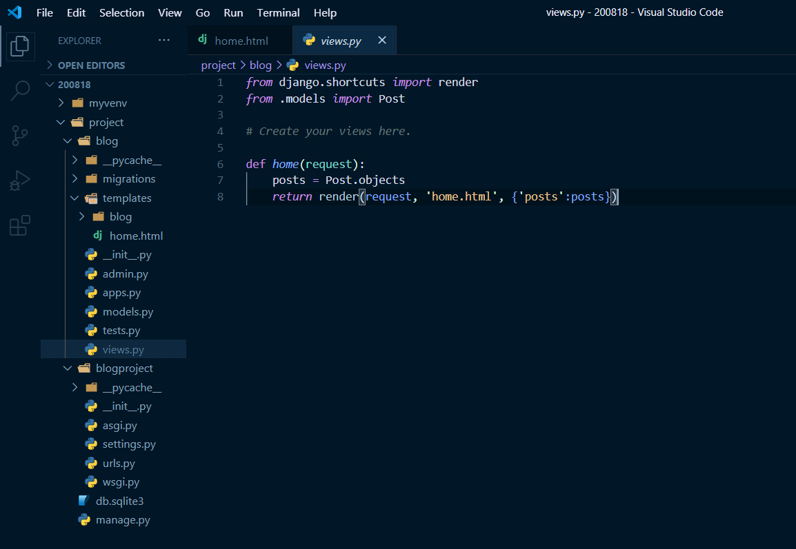
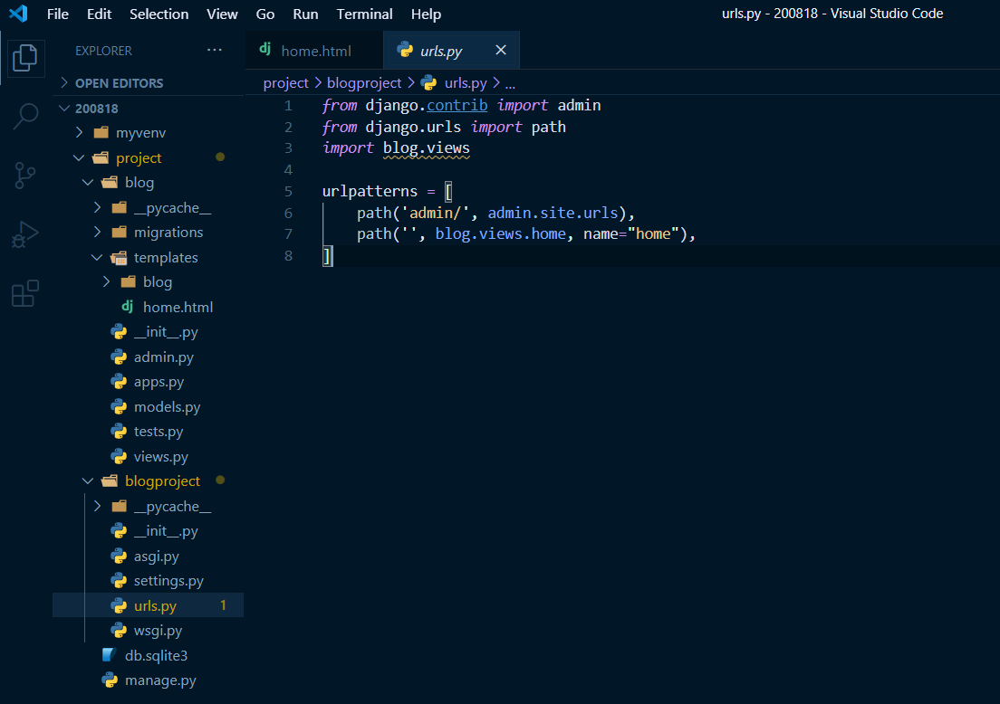
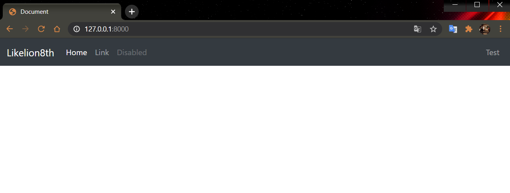
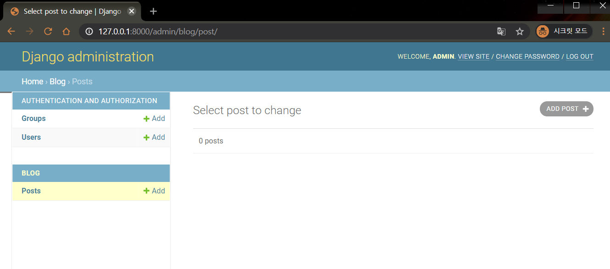
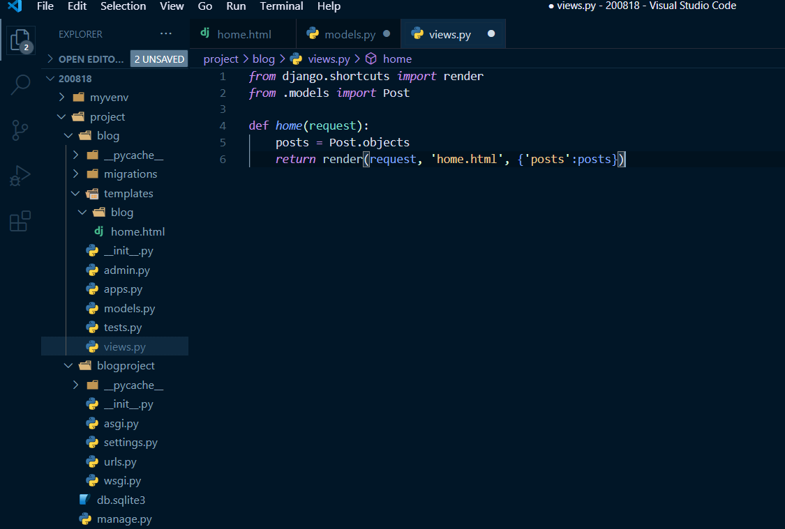
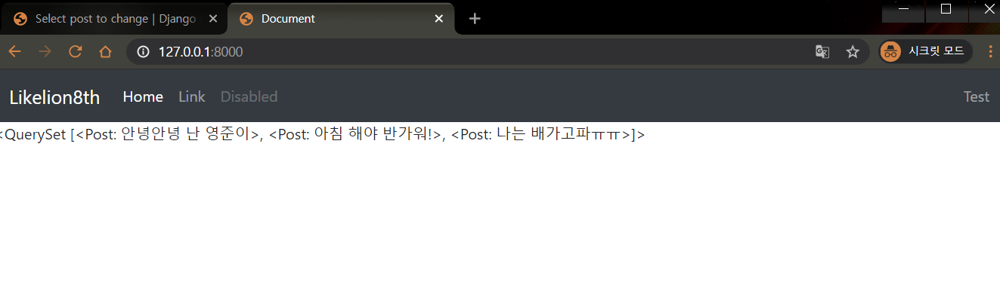
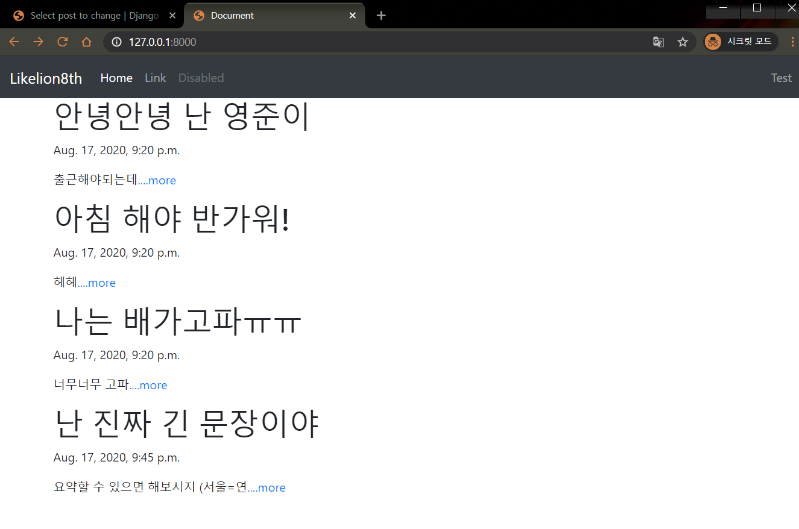
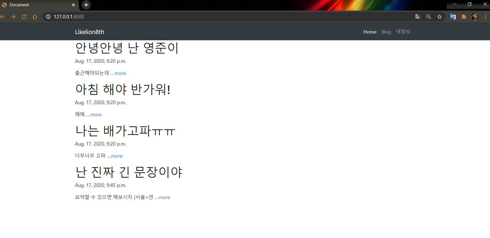
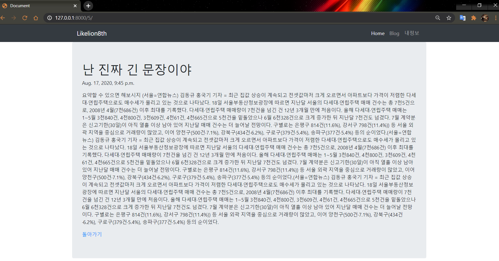

# Django 블로그 project 만들기-1
  
  
  
#### 🧱Preference

> Windows10  
> python 3.7 이상  
> Git Bash  
> MTV 기본적인 개념

---

## 1. Blog 프로젝트 만들기

[이전 Session](https://github.com/Mulgyeol/2020-Django/blob/master/1.md) 중복 내용입니다

가상환경을 만들고 django pip 패키지 설치를 진행합니다.

이전 강의와 동일하게 `blogproject`로 프로젝트를 만들어볼게요.

```bash
$ python -m venv myvenv # 가상환경 생성

$ source myvenv/scripts/activate # 가상환경 실행

$ pip install django # django 설치

$ django-admin startproject blogproject #프로젝트 생성

# 이때 manage.py가 위치한 프로젝트 안(BASE_DIR)으로 들어간다.

$ python manage.py startapp 'blog' # app 생성

$ python manage.py runserver # http://127.0.0.1:8000/
```

> 가상환경을 종료하려면 `deactivate`를 입력하면 됩니다.

---

## 2. settings.py - blog App 추가

`[이전 Session](https://github.com/Mulgyeol/2020-Django/blob/master/1.md) 중복 내용입니다`

project를 생성하고 app도 만들었으니, `settings.py`에 app을 명시해줍니다.

```python
# settings.py
INSTALLED_APPS = [
    'django.contrib.admin',
    'django.contrib.auth',
    'django.contrib.contenttypes',
    'django.contrib.sessions',
    'django.contrib.messages',
    'django.contrib.staticfiles',
    'blog',
]
```

---

## 3. template 만들기

경로 : `blog/templates/blog/home.html`

이번 강의에서는 부트스트랩4를 활용해서 `navbar`를 넣어볼게요.

제가 적용한 코드를 사용하셔도 좋고 다른 부트스트랩 [navbar](](https://bootsnipp.com/snippets/nNX3a)를 사용하셔도 좋습니다!

저는 예제 코드에 맞게 코드를 조금 수정했습니다.

```HTML
        <nav class="navbar navbar-expand-lg navbar-dark bg-dark">
        <div class="container">
            <a class="navbar-brand" href="">Likelion8th</a>
            <button class="navbar-toggler" type="button" data-toggle="collapse" data-target="#navbarNavAltMarkup"
                aria-controls="navbarNavAltMarkup" aria-expanded="false" aria-label="Toggle navigation">
                <span class="navbar-toggler-icon"></span>
            </button>
            <div class="collapse navbar-collapse" id="navbarNavAltMarkup">
                <div class="navbar-nav ml-auto">
                    <a class="nav-item nav-link active" href="">Home</span></a>
                    <a class="nav-item nav-link" href="#">Blog</a>
                    <a class="nav-item nav-link" href="#">내정보</a>
                </div>
            </div>
        </div>
    </nav>
```

body 태그 안에 내용을 복붙해서 확인해보셔도 좋아요.

잘 안되면 [전체코드](https://gist.github.com/jun108059/32f94be4692125b6bdc5013e9d5c2d12)를 참고하시면 됩니다.

---

## 4. view 만들기

요청이 들어오면 home.html 파일을 열어주는 함수를 blog 폴더 내부에 `views.py`파일에 작성해봅시다.


 
> 함수 이름은 마음대로 정하셔도 상관 없어요!  

----

## 5. URLconf 연결

다음은 url을 연결해주어야 합니다.

`urls.py` 파일을 열어 다음 내용을 추가하세요.

```python
from django.contrib import admin
from django.urls import path
import blog.views

urlpatterns = [
    path('admin/', admin.site.urls),
    path('', blog.views.home, name="home"),
]
```

  



> 중간 화면은 이렇게 출력됩니다.

---

## 6. models.py 작성

[이전 Session](https://github.com/Mulgyeol/2020-Django/blob/master/1.md) 중복 내용이 있습니다.

이전 자료에서 사용됐던 데이터로 진행하겠습니다.

- 제목
- 내용
- 작성일자

blog 폴더 내에서 `models.py`를 열어

아래와 같은 코드를 작성해 줍니다.

```python
from django.db import models

class Post(models.Model):
    title = models.CharField(max_length=200)
    pub_date = models.DateTimeField('date published')
    body = models.TextField()
```

<details><summary>설명 보기</summary> 

- `title` : 제목  
- `body` : 본문  
- `pub_date` : 작성일자  

1. title 속성은 최대 length가 200인 문자열
2. pub_date 속성은 날짜와 시간
3. body 속성은 긴 문자열

</details>

---

## 7. Database migration

database 모델을 작성한 이후에는 항상 다음 과정을 거쳐야 합니다.

1. `models.py`에서 코드 작성
2. `python manage.py makemigrations` 을 통해 migration 만들기
3. `python manage.py migrate` 을 통해 데이터베이스에 적용하기

```bash
$ python manage.py makemigrations
$ python manage.py migrate
```

<details><summary>migration이란?</summary> 

Django는 python으로 작동하는 웹 프레임워크이지만 DB(데이터베이스)의 경우는 그렇지 않습니다. 그래서 우리가 내린 python 코드를 DB가 알아 듣게 설명을 해줘야하는 작업이 필요합니다. 위의 makemigrations는 내가 짠 파이썬 코드를 DB가 알아들을수 있게 번역하는 명령어이고, migrate는 DB에 그 내용을 적용하라는 명령어입니다.

</details>

---

## 8. Admin 생성

블로그 게시글을 관리하는 관리자`admin`를 만들어주는 코드를 작성해봅시다.

```bash
$ python manage.py createsuperuser
```

- 이름
- 이메일
- 비밀번호 (안보이는게 정상)
- 비밀번호 확인 (안보이는게 정상)


서버가 켜져있는지 확인하고
`127.0.0.1/admin` 주소로 접속하면 방금 입력한 계정으로 로그인할 수 있습니다.

조금 생성한 model인 `post`가 없는 관리자 페이지가 보이실거에요.

django에게는 우리가 model을 만들었다는 것을 `migrate`를 통해 알렸지만, 

admin에게는 알려주지 않았기 때문입니다.

---

## 9. Admin에 model 등록하기

blog 폴더 안으로 들어가서 admin.py를 수정합니다.

```python
from django.contrib import admin
from .models import Post

admin.site.register(Post)
```

- `from .models import Post` : 같은 폴더에 위치해있는 models라는 파일에 Post를 가져옵니다.
- `admin.site.register` : admin 사이트에 Post라는 클래스를 등록합니다.



---

## 10. Admin page에서 게시글 작성하기

정상적으로 `Post`가 뜨는 것을 확인했다면 Post를 작성하고 저장할 수 있습니다.

<details><summary>추가된 Post를 title로 인덱싱하려면</summary> 
blog 폴더 안의 models.py에 `Post` 클래스를 수정해주면 됩니다.

```python
from django.db import models

class Post(models.Model):
    title = models.CharField(max_length=200)
    pub_date = models.DateTimeField('date published')
    body = models.TextField()
    
    def __str__(self):
        return self.title
```

마지막에 `__str__` 이라는 함수가 추가됐는데 간단히 생긴 것만 보면 자기 자신`self`를 받아서 `title`을 반환해주기 때문에 제목이 보일 수 있다는 정도로 이해하면 됩니다!
</details>

---

### Delete하기


## 11. view로 데이터 가져오기

model을 만들고 그 안에 데이터도 넣었으면 이걸 `template`으로 보내 보여줘야 합니다.

그런데 model에서 template으로 바로 내용을 보낼수는 없고 항상 `view`를 거쳐서 보냅니다.

```python
from django.shortcuts import render
from .models import Post

def home(request):
    posts = Post.objects
    return render(request, 'home.html', {'posts':posts})
```



**✔코드 살펴보기**  

- `from .models import Post` : views.py파일에 Post를 `import`해주는 작업  
- `posts = Post.objects` : `Post.objects` 라는 것을 posts 라는 변수에다가 할당  
- `Post.objects` : 아까 admin 페이지에서 확인했던 blog 안의 data  
- `return render(request, 'home.html', {'posts':posts})` : posts라는 변수를 template에서 쓸때 `posts`라는 이름으로 가져오겠다고 명명하는 작업입니다.  

**✔posts 로 내용 확인**

`navbar` 아래쪽 body 끝나기 전 부분에 추가해주면 됩니다.

모르겠으면 [확인](https://gist.github.com/jun108059/73f2fe3b3299b93db421761561001046)하고 오세요!



**✔게시글 예쁘게 띄워주기**

코드를 [다음과 같이](https://gist.github.com/jun108059/2b9ea95da252e92217dd090c3a1d927e) 수정해주면 됩니다.

---

## 12. Detail page 만들기

자세한 설명과 방법이 [이전 Session](https://github.com/Mulgyeol/2020-Django/blob/master/3.md)에서 잘 설명되어 있기 때문에 **빠르게** 넘어가봅시다.

### template 추가하기

길어지는 본문을 모두 표시하지 않고 일부만 보여줄 수 있게 설정!

`blog/templates/blog` 폴더 내부 `detail.html` 생성

### URLconfig 추가

추가되는 게시글에 효과적으로 매칭될 수 있는 URL 설정

```python
urlpatterns = [
    path('admin/', admin.site.urls),
    path('', blog.views.home, name="home"),
    path('<int:post_id>/', blog.views.detail, name="detail"),
]
```

`<int:post_id>`라고 적힌 부분은 각 게시물의 id값이 할당

<details><summary>path-converter?</summary>  


우리가 아까 적어줬던 `<int:post_id>`같은 것들을 path-converter라고 합니다.

장고에서 여러 객체들을 다루는 계층적 url이 필요할 경우에 사용하며, `<type:name>`와 같은 모양입니다.

'지정한 converter type의 name변수를 view 함수로 넘겨라' 하고 정리할 수 있겠네요.

converter의 다양한 타입에 대해 궁금하시면 구글에 검색해보시는 걸 추천드립니다!
</details>

---

## 13. view 만들기

template을 연결해봅시다.

```python
from django.shortcuts import render, get_object_or_404
from .models import Post

def home(request):
    posts = Post.objects
    return render(request, 'home.html', {'posts':posts})

def detail(request, post_id):
    post_detail = get_object_or_404(Post, pk=post_id)
    return render(request, 'detail.html', {'post':post_detail})
```

지난 8월 8일 [강의자료](https://github.com/lee-sj/2020-django/blob/master/2020_08_08_handler_sorry.md)에 있는 `404 handler`를 처리한 부분입니다.

`get_object_or_404` : object를 가져오고 없으면 404 에러를 띄우라는 내용의 함수입니다. 

안에 `모델명(대문자로 시작)`과 불러올 blog 게시글의 id값을 적어 주면 됩니다. 여기서 게시글의 id가 `pk`가 됩니다.

`pk`는 여러분 주민등록번호 처럼 고유하게 인식되며 중복될 수 없는 값이라고 이해하시면 될 것 같아요.

이렇게 담은 데이터를 `post`에 담아 넘겨줍니다.

- 선언한 `detail`함수는 request와 post_id를 함께 받아 해당 데이터를 전송
- urls.py에서 받아달라고 인자를 전송
- views.py 받아서 처리

### 보여질 글자 수 지정하기

blog폴더의 `models.py`에 코드를 추가로 작성해 주겠습니다.

```python
from django.db import models

class Post(models.Model):
    title = models.CharField(max_length=200)
    pub_date = models.DateTimeField('date published')
    body = models.TextField()

    def __str__(self):
        return self.title
# 아래 코드 추가
    def summary(self):
        return self.body[:20]
```

- def summary(self): 부분을 추가합니다.
- summary는 body의 20번째 글자 전까지만 보여주게 합니다.

### home.html 수정 & url 연결

home을 수정하면 깔끔해집니다.



detail이 잘 보입니다.




## 14. 게시글 등록 페이지 만들기

모든 사용자가 블로그 글을 작성할 수 있도록 등록 페이지를 만들어 봅시다.

### template 만들기

경로 : `blog/templates/blog/new.html`

이전에 만들었던 `home.html`파일을 가져와서 navbar 부분을 살리고 `글쓰기` 탭을 추가해봅시다.

> bootstrap 관련 내용은 생략하겠습니다.  

글을 작성할 수 있는 `form` 태그를 활용해 글을 쓸 수 있도록 만들어 보겠습니다.

```HTML
<br>
<div class="container">
	<form action="">
	  <h4>제목: </h4>
	  <input type="text" name="title">
	  <br>
	  <br>
	  <h4>본문: </h4>
	  <textarea cols=40 rows=10 name="body"></textarea>
	  <br>
	  <br>
	  <input class="btn btn-dark" type="submit" value="제출하기">
  </form>
</div>
```

## 15. 제출하기 버튼 활성화

제출하기 버튼을 누르면 DB에 저장이 되도록 구현하려고 합니다.

관리자가 post를 추가한 것과 마찬가지로 `home` 화면에서도 보여지도록 해야합니다.

### template 수정하기

제출 버튼을 눌렀을 때 `url`을 통해 데이터를 넘겨봅시다.

```python
<form action="">
```

이 action에 url을 넘겨주면 됩니다!

### url 설정하기

```python
path('blog/create/', blog.views.create, name='create'),
```

`path`들을 적어 놓은 곳에 코드 한 줄을 더 추가하면 됩니다.

이제 위에 설정해준 `create` 요청이 들어오면 create 함수를 부르도록 지정됐습니다.

### view 작성하기

`view`에서 create함수를 만들어 줍니다.

```python
from django.shortcuts import render, get_object_or_404
from django.utils import timezone

from .models import Post

def home(request):
    posts = Post.objects
    return render(request, 'home.html', {'posts':posts})

def detail(request, post_id):
    post_detail = get_object_or_404(Post, pk=post_id)
    return render(request, 'detail.html', {'post':post_detail})
    
def new(request):
    return render(request, 'post/new.html')

def create(request):
    post = Post()
    post.title = request.GET['title']
    post.body = request.GET['body']
    post.pub_date = timezone.datetime.now()
    post.save()
    return redirect('/blog/' + str(post.id))
```

이렇게 create 함수를 작성하면 DB에 데이터를 저장할 수 있습니다.


- `request.GET['title']`은 new.html 파일에 form태그 안에 있는 녀석입니다. 코드를 확인해 보면 `name="title"`이라고 적혀있을텐데 그래서 `GET[]` 안에 'title'이 들어가는 겁니다. `blog.body`도 동일한 논리입니다.  
- `blog.pub_date` 의 경우는 입력한 시간이 자동으로 넘어가게끔 코드를 구성했습니다. 이때 `timezone`이라는 패키지를 사용해야해서 두번째 줄에 보면 `import`를 해주는 겁니다.  
- `redirect` 는 요청을 처리하고 보여주는 페이지 입니다. `render`가 '요청이 들어오면 이 html 파일을 보여줘 라는 녀석'이였다면, `redirect`는 '요청을 들어오면 저쪽 url로 보내버려' 하는 녀석입니다.  

---

## 16. 게시글 삭제하기

게시글을 삭제하는 로직도 간단합니다!

관리자`admin` 페이지에서 게시글 삭제는 django에서 지원하는 기능이고 우리가 직접 구현할 수 있습니다.

위에서 구현했던 `more` 더보기를 눌렀을 때 상세 페이지인 `detail`이 뜨는데 여기에 삭제할 수 있는 링크 연결하는 방식으로 구현하면 쉬울거에요.

간단히 로직 코드만 살펴보면

`detail.html`

```html
<div class="delete">
	<p><a href="">삭제하기</a></p>  
</div>
```

위에서 만들어준 `delete` 라는 이름을 가진 url을 만들어 줘야합니다.

현재 `detail` 페이지의 url인 `localhost:8000/<post_id>` 뒤에 추가하면 간단하게 만들 수 있습니다.

`urls.py`

```python
urlpatterns = [
    path('admin/', admin.site.urls),
    path('', blog.views.home, name="home"),
    path('<int:post_id>/', blog.views.detail, name="detail"),
    path('<int:post_id>/delete', blog.views.detail, name="delete"),
]
```

urls.py에 따라 경로로 접근 시 `delete`라는 함수가 실행되고, 파라미터로 request를 받고, detail.html을 확인해보면 `post_id`를 받아옵니다. 

받아온 id를 통해 게시글이 삭제된 이후 `redirect`를 통해 `localhost:8000`, home으로 이동합니다.


`views.py`

```python
def delete(request, post_id):
    post_num = get_object_or_404(Post, pk=post_id)
    post_num.delete()
    return redirect('/')
```

