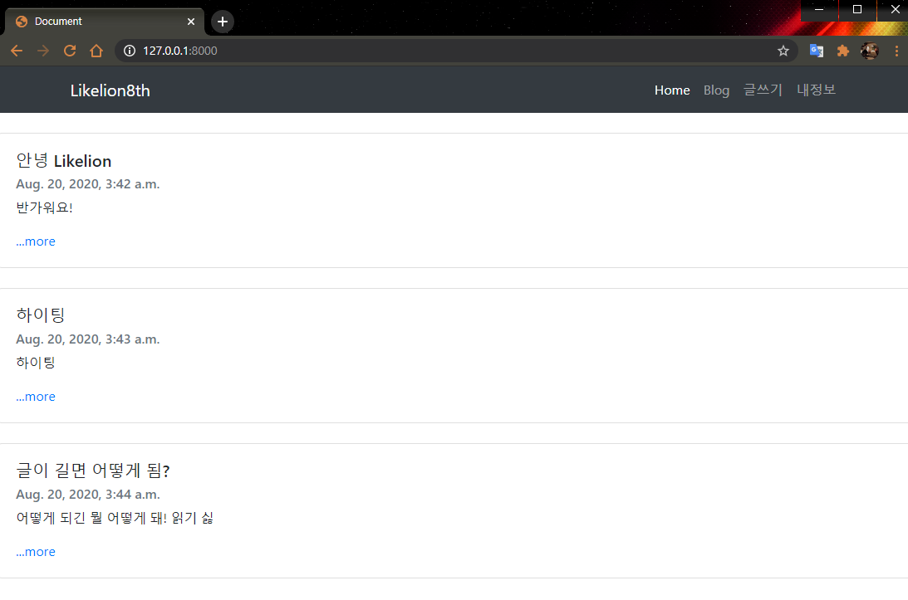
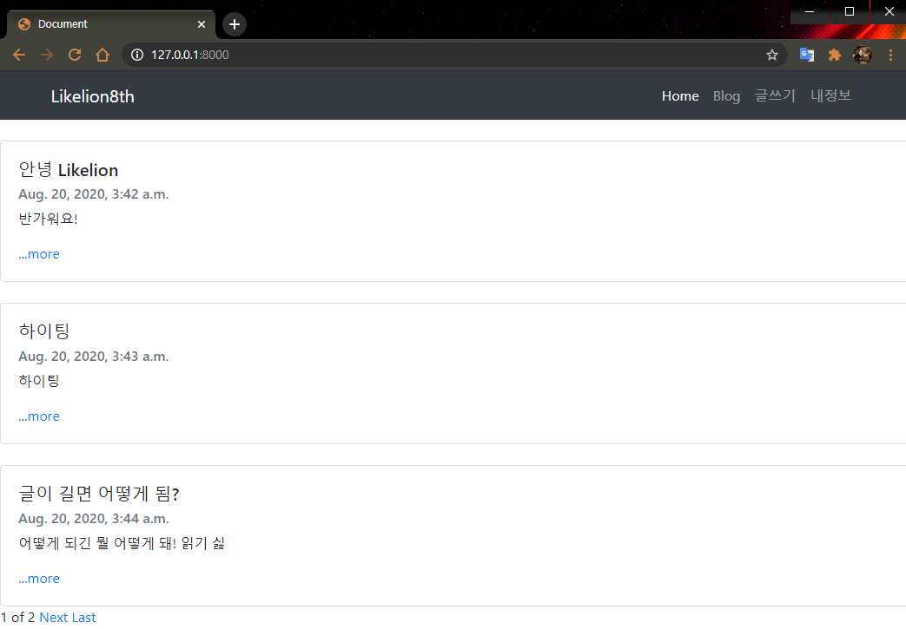
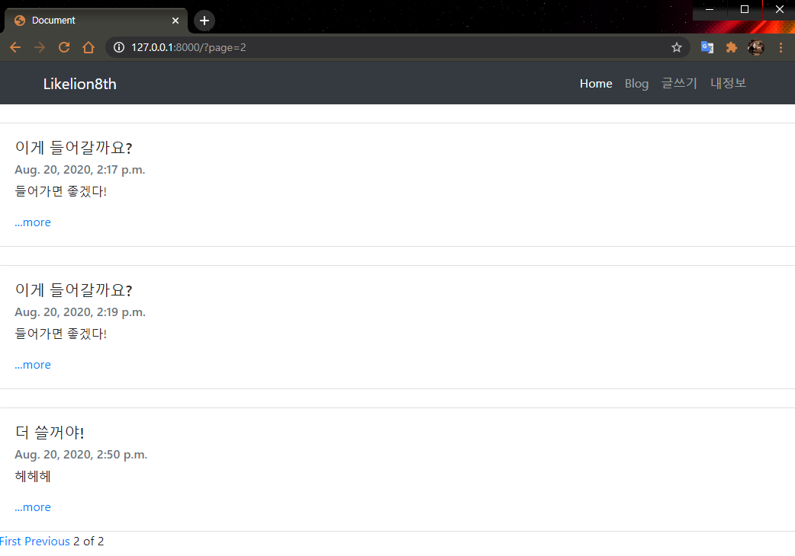
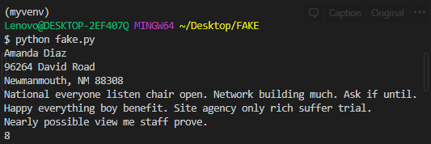

# Django 블로그 project 만들기-2
  
  
  
#### 🧱Preference

> Windows10  
> python 3.7 이상  
> Git Bash  
> MTV 기본적인 개념

---

## 1. Pagination

블로그 게시판에 글이 계속 늘어난다면 한페이지로 보는 것은 말도 안되는 일이 되겠죠!

대부분의 게시판 형식은 한 페이지에 일정한 개수의 게시글만 보이게끔 페이지를 나눠서 보여줍니다.

이를 `pagination`이라고 합니다. 같이 한번 구현해봐요!

이전 강의를 이어서 하기 때문에 가상환경, 패키지 설치, 프로젝트 생성은 생략하겠습니다.

글 목록을 페이징 할 예정이기 때문에 `home`함수를 수정해야겠죠.

[다음 views.py 코드](https://gist.github.com/jun108059/6674cac11bce906f0e6e11966ca43534)를 살펴봅시다!

---

먼저 `Paginator`을 import 해줍니다.

그리고 Blog객체들의 쿼리셋을 가져와 모든 데이터들을 변수에 넣습니다.

`Paginator(posts_list,3)` 구문을 통해 paginator함수를 사용해보세요.

blog_list에 들어가 있는 블로그 객체들을 3개씩 자른다는 의미입니다. 

이제 각 페이지마다 3개의 객체들이 들어있습니다.

이제 몇 번 페이지를 불러올지만 알아내면 될 것 같습니다. 

`request.GET.get('page')` 는 'page'를 key값으로 가지는 객체의 value를 가져옵니다. 

page값이 어디서 튀어나왔는지 모르겠다구요? 아직 없습니다. 우리는 조금 이따 html을 손 보며 page값을 보내줄거니 걱정 안 하셔도 괜찮습니다.


자. 페이지 값까지 얻었습니다! 이제 우리는 우리가 보여주고 싶은 페이지의 게시글들을 html에 뿌려주기만 하면 됩니다. 

`posts_num = paginator.get_page(page)` 는 출력을 원하는 page를 가져와줍니다.

출력을 원하는 페이지를 render함수 마지막 인자에 추가한 뒤 리턴해줍니다.

---

### template 수정하기

이젠 모든 게시글이 아닌 보여주고 싶은 페이지의 게시글만 보여주면 됩니다.

원래 모든 게시글의 숫자만큼 돌던 for문이 기억나시나요?

이제 우리는 원하는 페이지의 게시글만 출력하면 됩니다.

[작성된 코드](https://gist.github.com/jun108059/ffa9a110c8b6d751261f724693ead835)를 보면 해당 페이지에 담긴 객체만큼만 for문을 도는 걸 확인 할 수 있습니다.



더많은 게시글이 있지만 설정해준대로 3개만 보여지는걸 알 수 있어요!

> 여기서는 div class를 `card`로 바꿔서 더 깔끔하게 출력되도록 수정도 했습니다!  
> 예쁘면 좋으니까 마음대로 꾸미셔도 돼요!   
> 안하셔도 되구요!😄

3개씩 보이는건 됐고 다음/이전 페이지로 넘어가는 기능이 필요할 것 같요!

---

### 이전 페이지, 다음 페이지 추가

[작성된 코드](https://gist.github.com/jun108059/cf971318170140299a948e8204cc6fff)를 보면 조금 어려워보이지만 하나씩 살펴보면 크게 어려운 점은 없습니다.

[코드에 대한 설명](https://gist.github.com/jun108059/170e516dee4393defca891ab2d5c11c2)을 읽어보시면서 천천히 공부해보시면 좋을 것 같아요.

정리하자면 home.html에서 이동하고자 하는 페이지를 view로 넘기고, view는 그 페이지를 띄워줍니다.

또, 만약 현재 페이지가 1페이지라면 첫페이지로 이동 및 이전 페이지로 이동 링크는 보이지 않습니다. 마지막 페이지도 마찬가지입니다.




---

## 2. Faker

여러분 블로그 프로젝트 하실 때 테스트 하느라 admin페이지에서 한글자 한글자 게시글 작성하신 거 압니다. 다들 고생하셨습니다. 이번 시간에는 이런 우리의 수고를 덜어줄 faker를 배워보겠습니다. faker을 이용하면 랜덤으로 다양한 종류의 데이터를 생성할 수 있습니다.

백문이 불여일타. 직접 해보도록 하겠습니다.

먼저 FAKE폴더를 새롭게 만들어 가상환경을 실행해줍니다.

그리고 아주 오랜만에 새로운 pip패키지를 설치합니다.

```bash
pip install faker
```

```python
from faker import Faker

myfake = Faker()

print(myfake.name()) 
print(myfake.address())
print(myfake.text()) 
print(myfake.sentence())
print(myfake.random_number())
```

먼저 faker 패키지를 import해줍니다. 이어 faker객체를 만든 뒤 위와 같이 쓰고 실행해봅시다.




첫째줄은 `myfake.name()`을 출력한 결과로 랜덤으로 이름이 생성된 것을 볼 수 있습니다.

둘째줄,셋째줄은 `myfake.address()`를 출력한 결과로 랜덤으로 주소가 생성된 것을 볼 수 있습니다.

넷째줄은 `myfake.text()` 를 출력한 결과 랜덤으로 아무 말이 생성되었습니다.

다섯째줄은 `myfake.sentence()`를 출력한 결과로 아무 문장이, 마지막 줄은 `myfake.random_number()`을 출력한 결과로 랜덤숫자가 나오게 됩니다.

우리는 이런 Faker와 for문을 적절히 사용하여 이제는 블로그에 글 100개를 순식간에 쓸 수 있을 것 같습니다.

근데, 이렇게 랜덤으로 출력된 결과를 유지하고 싶을 때는 어떻게 해야할까요?


```python
myfake.seed(1)
```

Seed를 사용하면 항상 같은 값을 출력할 수 있습니다. 이해가 어렵다면, seed를 씨앗이라고 생각해봅시다. 

같은 씨앗을 심으면 같은 꽃이 피는 것 처럼 같은 seed값을 사용하면 같은 결과가 출력됩니다. 

위의 코드를 응용해 이것저것 시도해본다면 분명 빠르게 이해할 수 있을 것입니다.