# Django Portfolio 만들기 (Static)
  
  
  
#### 🧱Preference

> Windows10  
> python 3.7 이상  
> Git Bash  
> MTV 기본적인 개념

---

앞서 글을 쓰는 블로그 게시판을 구현했습니다. 기왕 블로그 만든거 이번엔 여러분의 `포트폴리오`를 보여주는 페이지를 만들어봅시다.

`포트폴리오`에는 사진이 필수니, 이번엔 장고로 여러분들이 원하는 사진을 띄워볼겁니다.

## 1. 새로운 app 만들기

이번엔 Django를 이용해 여러 파일들을 다뤄보는 내용을 배워봅시다. 새로운 기능이니 새로운 app으로 만들 계획이고, 복습할 겸 처음부터 해봅시다.

앱을 만들기 전에 가상환경 꼭 켜주세요.

---

### app 만들기

```python
python manage.py startapp portfolio
```

위 명령어로 app을 새로만들면 portfolio 라는 이름의 새로운 폴더가 만들어집니다.

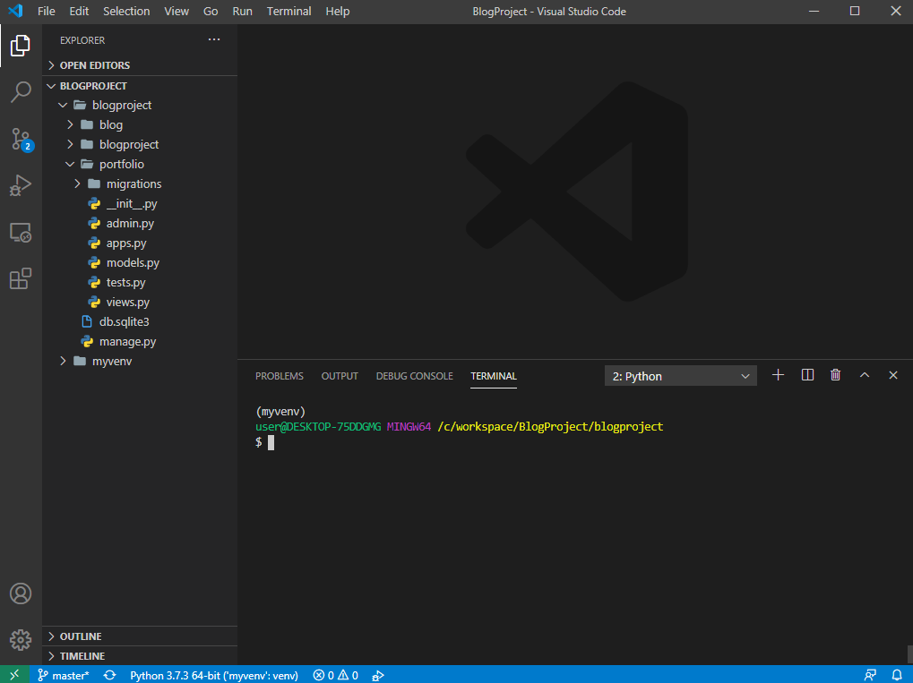

> 이제 여기서 다시 template도 만들고, view도 만들고, url도 수정해야하고 합니다.

먼저 우리 프로젝트에 app을 만들었다는걸 알려줍시다.

```python
INSTALLED_APPS = [
    'portfolio.apps.PortfolioConfig',
    # 생략
]
```

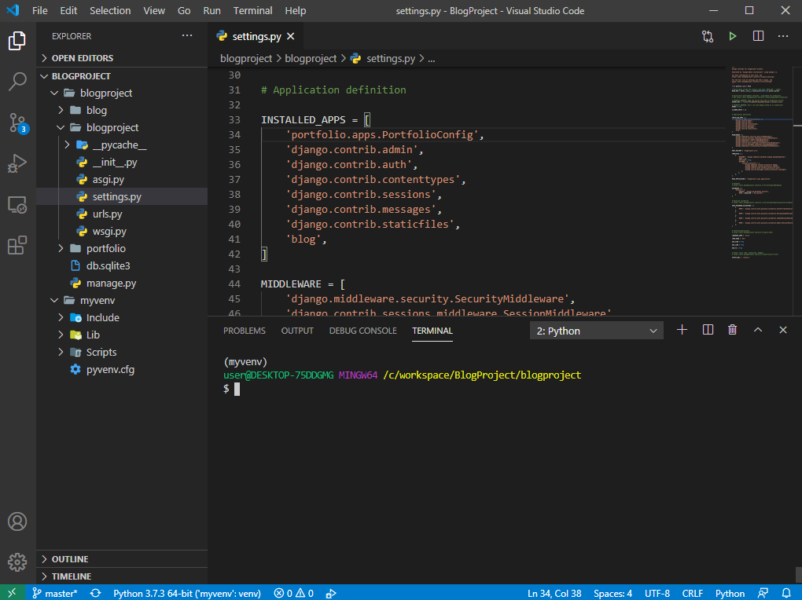

> settings.py를 열어 INSTALLED_APPS에 portfolio 앱을 추가해줍시다.

---

### template 만들기

이제 `portfoilo` 폴더 안에 `templates` 폴더를 만들고 그안에 `portfolio` 폴더를 만들고 `portfolio.html`을 만들어 봅시다. ~~(폴더 위치를 정확히 확인하세요!)~~

> 저번과 조금 다르게 처음부터 `portfolio(app)/templates/portfolio/portfolio.html` 경로에 만들었습니다!

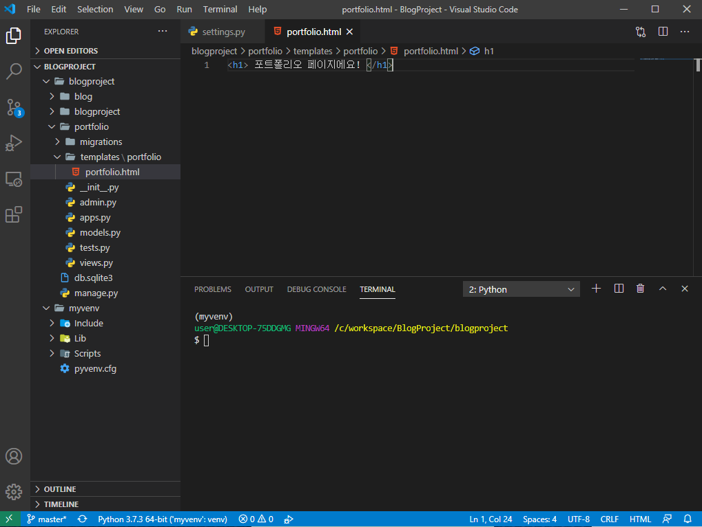

---

### view 만들기

portfolio 폴더 안에 있는 views.py를 열어봅시다.

`portfolio/views.py`

```python
from django.shortcuts import render

def portfolio(request):
    return render(request, 'portfolio/portfolio.html')
```

### url 수정하기

이제 urls.py를 수정하러 갑시다. urls.py는 `blogproject` 폴더 안에 있습니다.

```python
from django.contrib import admin
from django.urls import path
import blog.views
import portfolio.views

urlpatterns = [
    path('admin/', admin.site.urls),
    path('', blog.views.home, name="home"),
    path('<int:post_id>/', blog.views.detail, name="detail"),
    path('blog/new/', blog.views.new, name='new'),
    path('blog/create/', blog.views.create, name='create'),
    path('<int:post_id>/delete', blog.views.delete, name="delete"),

    path('portfolio/', portfolio.views.portfolio, name='portfolio'),
]
```

VS Code 폴더

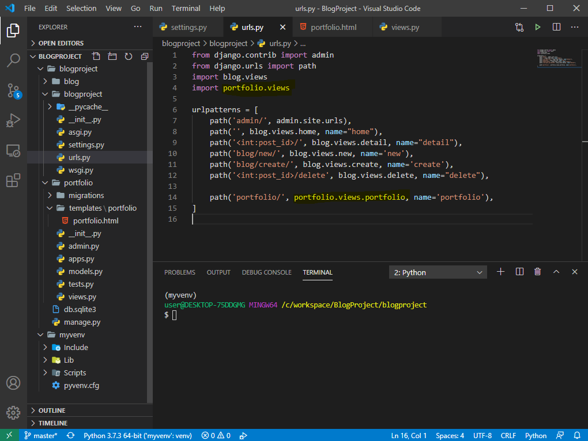

> **import**도 까먹지 말고 잘 적어주세요!

---

## 1-1. 중간 점검하기

서버를 돌려봅시다.

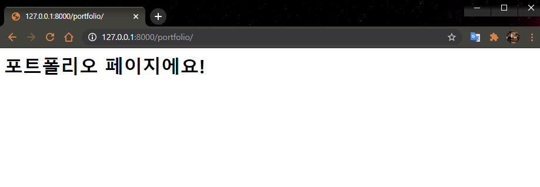

[127.0.0.1:8000/portfolio/](127.0.0.1:8000/portfolio/) 접속했을 때 화면이 잘 뜬다면 성공입니다!

---

## 2. 예쁜 포트폴리오 페이지 가져오기

우리의 친구 [부트스트랩](http://bootstrapk.com/)을 활용해서 그럴싸한 포트폴리오를 만들어봅시다.

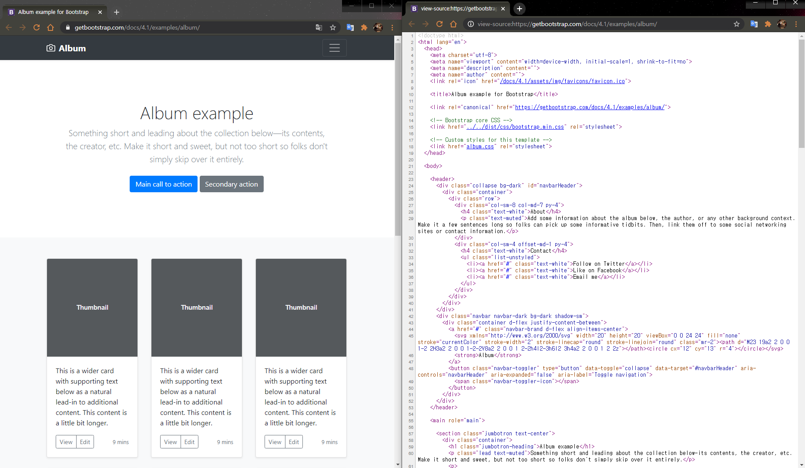

[템플릿 가지러 가기](http://getbootstrap.com/docs/4.5/examples/album/)를 클릭해서

사진과 같은 페이지에 접속해 `오른쪽 마우스 클릭 → 소스보기`를 눌러서 소스 페이지를 띄워주세요.

복붙합시다!

- `부트스트랩` 소스 코드 전체 복사
- `templates/portfolio/portfolio.html` 파일에 붙여넣기

저장하고 잘 들어갔는지 확인해보면 아래와 같은 화면이 뜰거에요.


---

### CSS JS가 로드가 안되는 경우

부트스트랩 공식 홈페이지에 올려둔 CSS, JS 코드를 추가해주면 됩니다.

귀찮으실 것 같아서 제가 [추가해놓은 코드](https://gist.github.com/jun108059/56a38cd45672f459d41624dcaca82e69)를 그대로 복사하셔서 사용하시면 됩니다.👋

---


## 3. 가져온 포트폴리오 수정하기(Static)


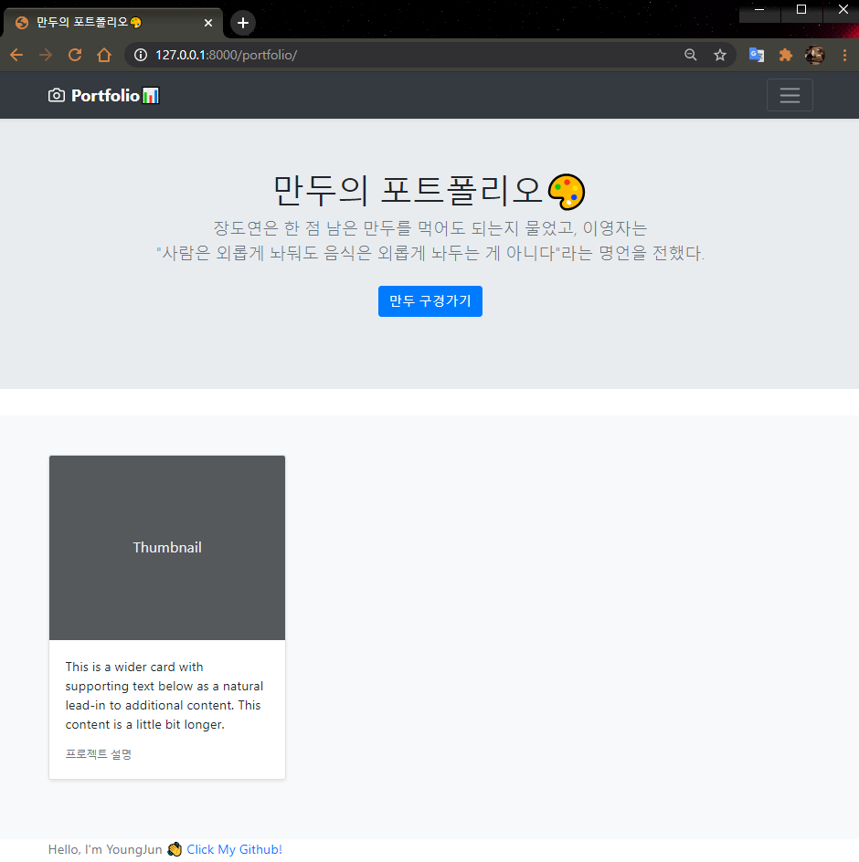

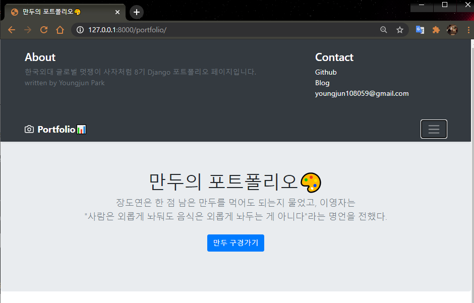

이 부분은 django가 아닌 bootstrap과 html 학습의 영역이라 설명은 생략합니다.

필요없는 부분은 제가 마음대로 지웠고 추가할 부분은 추가했어요!

[코드는 참고](https://gist.github.com/jun108059/3013c39bf1cba12a03f01b2beba60aa0)하시라고 올려둘게요😄

이제 비어있는 썸네일 사진을 수정해야겠죠! 

---

### Static file

로컬에서 사진을 올리기 위해서 `static file`에 대해 집고 넘어가야합니다. 

static 파일을 번역하면 정적 파일이라고 할 수 있는데, 앞서 static web페이지를 만들 때 사용했던 CSS, JS, image 같은 것들이라 생각하면 됩니다. 

> (static의 개념이 모호하다면 static web과 dynamic web에 대해 알아보세요.)

 Django는 static 파일을 2가지로 구분합니다.

- `static` - 웹서비스를 위해, 개발자가 준비해두는 파일
- `media` - 웹서비스 이용자들이 업로드하는 파일

먼저 **static 파일**을 이용해 `portfolio` 파일에 사진을 첨부해 봅시다.

portfolio 폴더 안에 static 폴더를 만들어줍니다. 그리고 그 폴더 안에 portfolio 화면에 띄우고 싶은 사진 한장을 넣어봅시다.

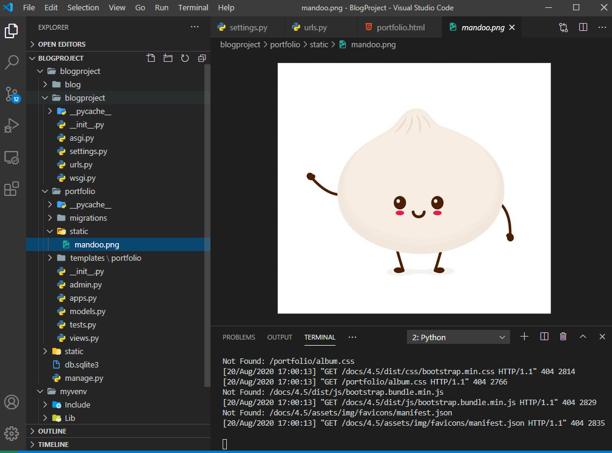

그리고 setting.py로 가서 아래 코드를 추가해줍시다.

**import os**도 함께 넣어줘야해요!

```python

STATICFILES_DIRS = [
    os.path.join(BASE_DIR, 'portfolio', 'static')
]

STATIC_ROOT = os.path.join(BASE_DIR, 'static')

```

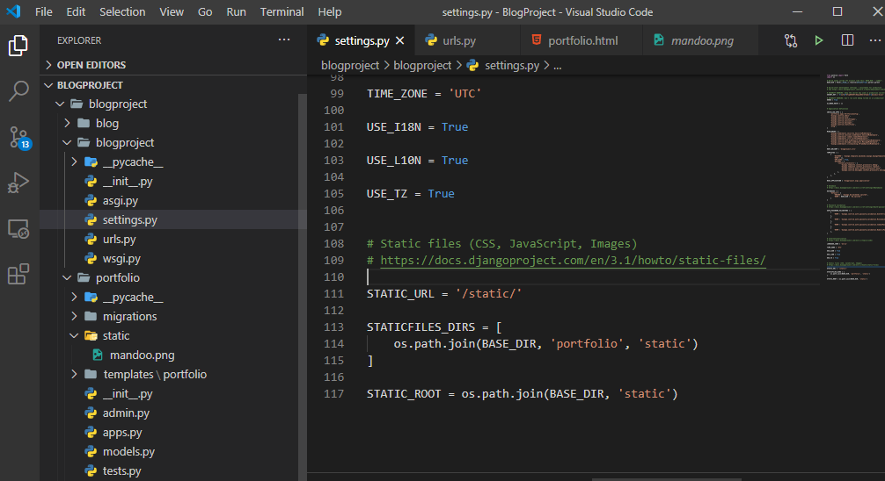

> 바로 요기 맨 밑에 static 어쩌고 나오는 위치에 넣어줍니다.

- `STATICFLES_DIRS` : static 파일들이 들어있는 경로를 적어줍니다.
- `STATIC_ROOT` : django에서는 편의를 위해 흩어져있는 static파일을 한곳에 모으는데, 그때 파일을 모아줄 위치를 나타냅니다.

위의 작업까지가 static 폴더를 만들고 우리 django 프로젝트에게 static 폴더라는게 생겼다는걸 알려주는 작업이였습니다. 그리고 터미널로 가서 static 파일들을 한곳에 모아주는 명령어를 입력합니다.

```bash
python manage.py collectstatic
```

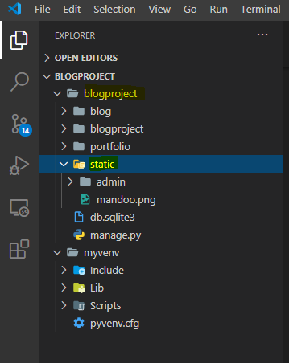

모두 제대로 진행했으면 `blogproject`의 하위폴더로 `static`폴더가 자동으로 생성됩니다.


새로 생긴 static 폴더는 settings.py의 STATICFLES_DIRS 경로 안에 있는 모든 static 파일들을 한 곳에 모아줍니다. 이 폴더의 위치는 STATIC_ROOT 에 설정해준 곳에 생깁니다.

그러면 이제 template으로 가서 static 폴더에 있는 `만두`를 띄워봅시다.

template에서 static폴더 안에 있는 파일들을 불러오기 위해서는 template에 static파일을 불러오겠다는 문구를 추가해줘야합니다.

```html

```

portfolio.html 파일안에 main 태그 위에 넣어 줍시다.

이제 html 시간에 배웠듯이 img 태그를 추가해 봅시다. src만 신경써서 적어주면 됩니다.

```html

```

를 이용해서 url 연결해주는 것과 비슷합니다.

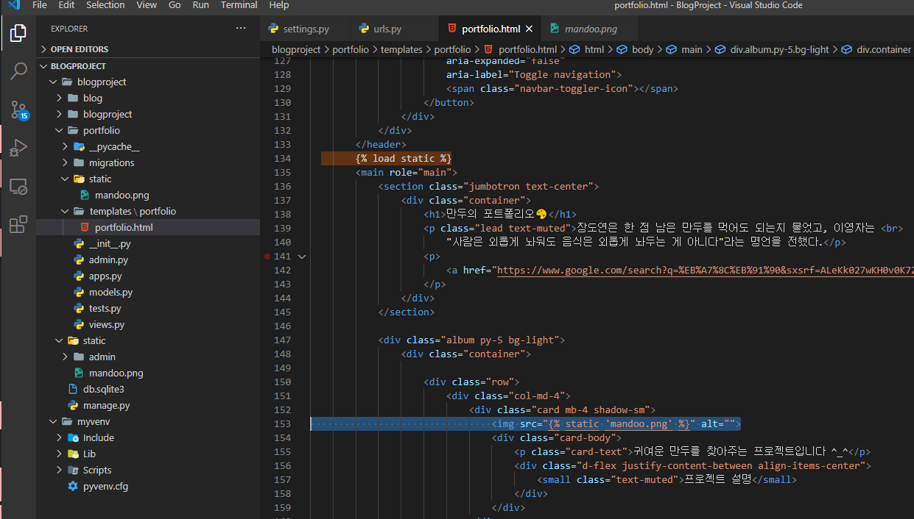

하이라이팅 된 부분을 추가했습니다!

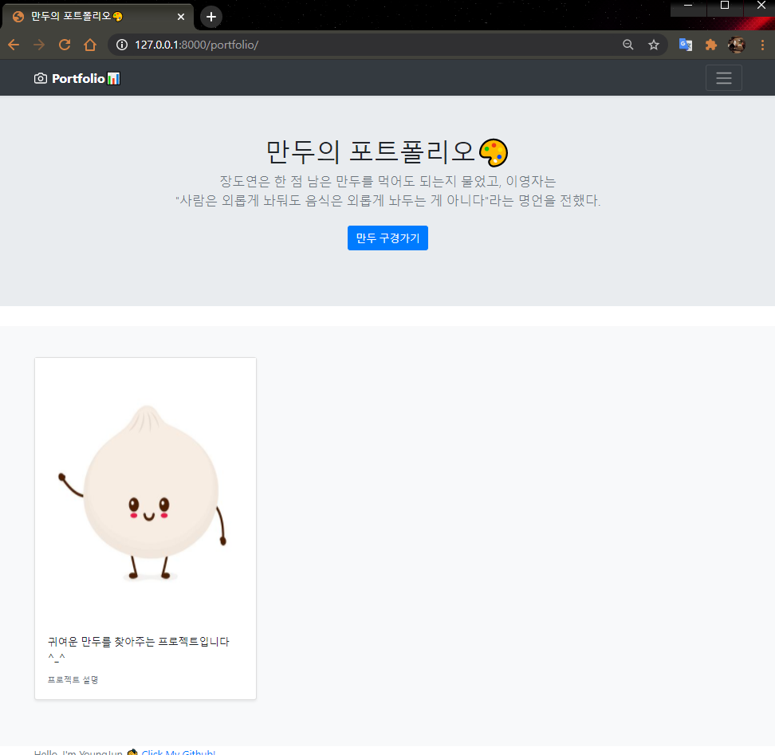

잘 나오면 성공입니다 ^_^

---