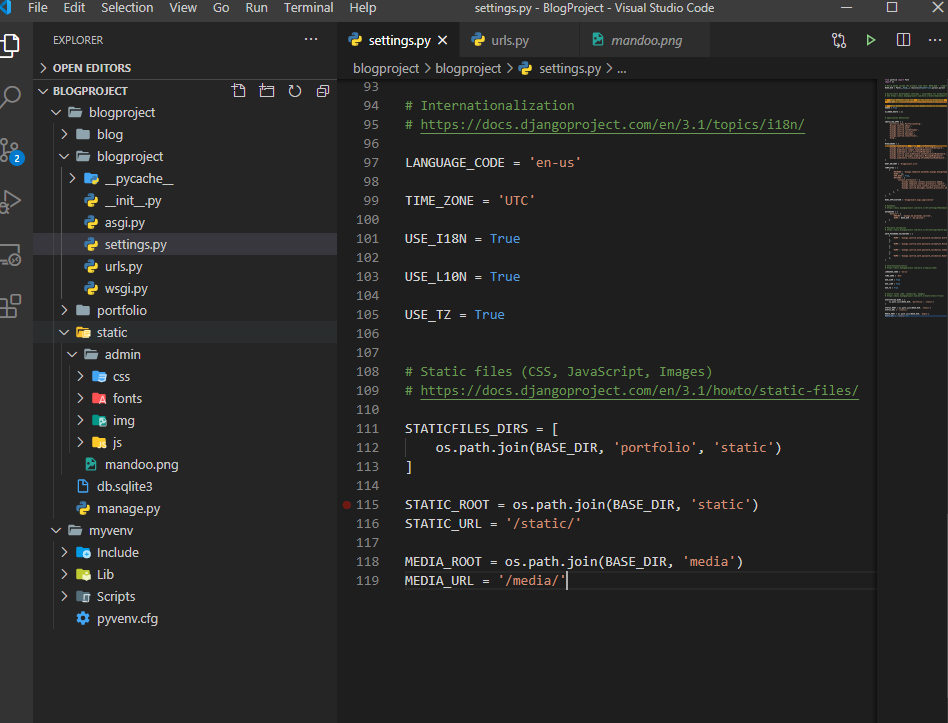
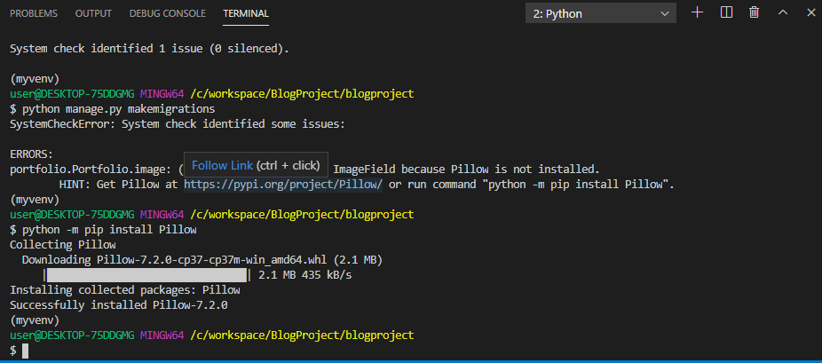
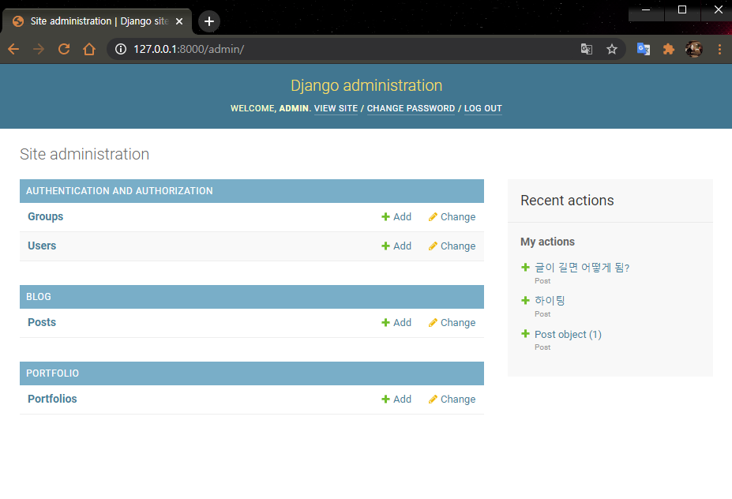
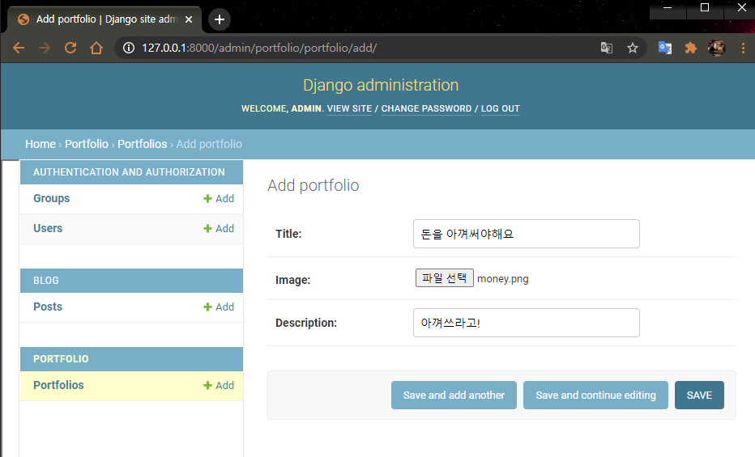
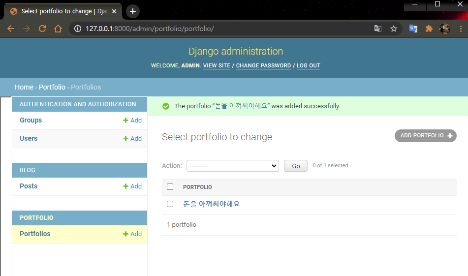
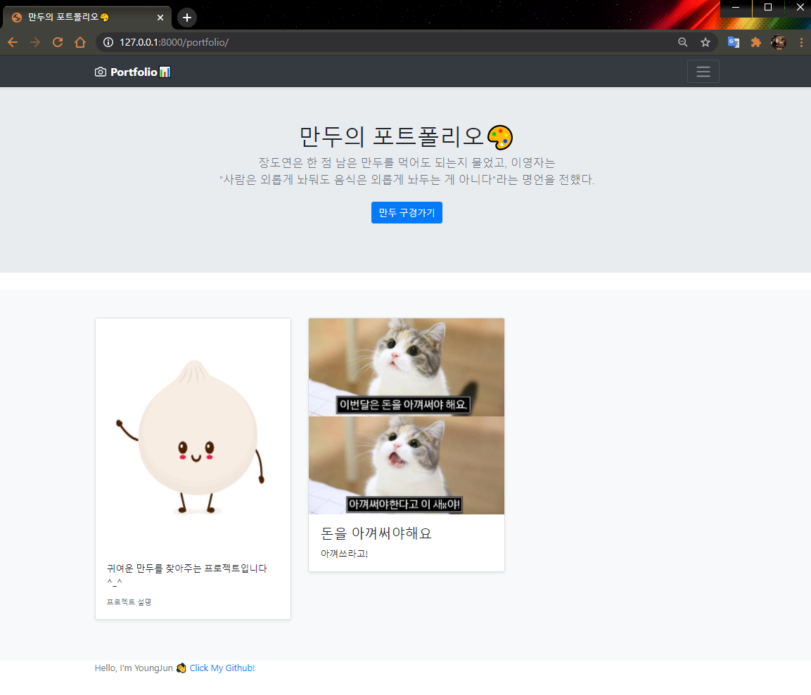

# Django Portfolio 만들기 (media)
  
  
  
#### 🧱Preference

> Windows10  
> python 3.7 이상  
> Git Bash  
> MTV 기본적인 개념

---

이제 모델을 활용해서 이미지를 업로드하고, `portfolio` 페이지에 띄워봅시다. 

먼저 사용자가 이미지를 업로드 하면 이미지가 저장될 장소부터 만들어 봅시다. 

앞서 Django는 `static파일`을 개발자가 준비하는 파일(static)과 

이용자들이 올리는 `파일(media)` 두가지로 구분한다고 했었습니다.

## settings.py에 media 설정하기

이전 시간에 작성했던 `STATIC_ROOT`와 `STATIC_URL` 그대로 복사 붙여넣기 합니다.

그리고 static을 전부 media로 바꿔줍니다.

```bash
MEDIA_ROOT = os.path.join(BASE_DIR, 'media')
MEDIA_URL = '/media/'
```



---

## url 수정하기

```python
from django.contrib import admin
from django.urls import path
import blog.views
import portfolio.views
from django.conf import settings
from django.conf.urls.static import static

urlpatterns = [
    path('admin/', admin.site.urls),
    path('', blog.views.home, name="home"),
    path('<int:post_id>/', blog.views.detail, name="detail"),
    path('blog/new/', blog.views.new, name='new'),
    path('blog/create/', blog.views.create, name='create'),
    path('<int:post_id>/delete', blog.views.delete, name="delete"),

    path('portfolio/', portfolio.views.portfolio, name='portfolio'),
]+ static(settings.MEDIA_URL, document_root=settings.MEDIA_ROOT)
```
urls.py의 내용을 위와 같이 수정합니다.  

`settings`와 `static` 관련 내용을 import하고 맨 마지막에 `static` 관련한 한줄을 추가해줍니다. 

그냥 이렇게 해야 올린 이미지를 읽어올수 있구나 생각하면 됩니다.

`참고`

```python
]+ static(settings.MEDIA_URL, document_root=settings.MEDIA_ROOT)

urlpatterns += static(settings.MEDIA_URL,document_root=settings.MEDIA_ROOT)
```

> 위의 모양이 이상하다, 익숙하지 않다 싶으시면 이렇게 쓰셔도 됩니다. 같은 뜻입니다.

---

## model 만들기

이번에 모델에서 받아올 정보는 이미지 파일과 텍스트 파일입니다. 모델을 만들어 봅시다.

portfolio폴더의 `models.py`를 열어 아래 코드를 입력해줍니다.

```python
class Portfolio(models.Model):
    title = models.CharField(max_length=255)
    image = models.ImageField(upload_to='images/')
    description = models.CharField(max_length=500)

    def __str__(self):
        return self.title
```

> `주의` class 명은 항상 대문자로 시작하게 만듭시다. 이건 개발자간의 약속입니다.

DB 안에 데이터들을 어떻게 구성할지 만드는 설계도 같은 겁니다. 여기에 어떤 방식으로 적어야하는지는 [django documentation](https://docs.djangoproject.com/ko/3.1/topics/db/models/)에 잘 나와있습니다. 원하는 모델 구성이 있을때 찾아보며 작성하면 됩니다.

앞서 만들었던 `blog app`의 model과 다른 점이 있다면 이미지를 업로드 한다는 점입니다.

그래서 `image`를 살펴보면 `upload_to='images/'`라는 내용이 있는데 

이부분이 업로드된 이미지들을 images 폴더안에 넣으라는 의미입니다.

위와 같이 모델 구성이 끝났으면 migration을 할 차례입니다.

```bash
python manage.py makemigrations
```

```bash
python manage.py migrate
```

를 순서대로 실행해줍니다. 경고창이 뜨면서 Pillow가 설치안됬다고 메세지가 나오면, 그것도 설치해 줍니다.

```bash
pip install Pillow
```




### admin에 모델 등록

그리고 django admin에게 새로운 모델이 생겼다는걸 알려줘야 합니다.

앞서 blog app에서 작성했던걸 복붙해 옵시다. blog 폴더 안에 admin.py안에 있는 내용을 복사해, portfolio 안 admin.py안에 붙여넣고, blog라고 쓰여진 내용을 전부 portfolio로 바꿉시다.

```python
from django.contrib import admin

from .models import Portfolio

# Register your models here.
admin.site.register(Portfolio)
```

저장하고 admin 페이지로 들어가 제대로 등록되었나 확인해 봅시다.



> 잘 뜬다면 성공

저장하고 admin 페이지로 들어가 제대로 등록되었나 확인해 봅시다.



> 이미지 하나 첨부해서 대충 글을 써봅시다.




> 저장 성공

---

## View 수정하기

이제 view를 수정해봅시다. 기존 `portfoilio.html`만 보여주었던 화면과 달리 model을 연결해 데이터를 받아야합니다. 


생각이 안나면 blog app안에 있는 view.py를 참고해 `portfolio app`의 view.py를
 아래 내용처럼 더듬더듬 수정해보세요.

```python
from django.shortcuts import render

from .models import Portfolio
# Create your views here.

def portfolio(request):
    portfolios = Portfolio.objects
    return render(request, 'portfolio/portfolio.html', {'portfolios': portfolios})
```

Portfolio객체들을 받아 html로 넘겨주는 내용입니다.

---

## Template 수정하기

이제 template을 수정해봅시다.

다음 내용을 추가하면 됩니다!

view에서 넘어온 portfolios를 아래와 같은 방식으로 뿌려줍니다.

```html
<div class="album py-5 bg-light">
  <div class="container">
	  <div class="row">
	  
	    <div class="col-md-4">
	      <div class="card mb-4 shadow-sm">
	        
	        <div class="card-body">
	          <h4>{{ portfolio.title }}</h4>
	          <p class="card-text">{{ portfolio.description }}</p>
	        </div>
	      </div>
	    </div>
    
    </div>
  </div>
</div>
```

[작성된 코드](https://gist.github.com/jun108059/df77a8684889ff0a3da3acf6c4d60f4c)도 올려드릴테니 참고해서 수정해보세요!




> 이렇게 나오면 성공!

정리해보자면,

1. settings.py에 media파일이 어떤 url을 타고 프로젝트로 들어올지, 어디로 모아줄지 정의합니다.
2. urls.py에 이미지가 타고 들어올 url을 설계해줍니다.
3. 업로드 하고싶은 데이터 class를 models.py에 정의해줍니다.
4. 이미지 업로드를 위한 pillow 모듈설치 후 DB가 알아들을 수 있도록 migration,migrate해줍니다.
5. admin.py에 우리 portfolio DB사용할거야 하고 알려줍니다. 이제 admin페이지에 portfolio가 나타납니다.
6. views.py에서 모든 객체를 받아 HTML로 넘겨줍니다.
7. HTML에 우리의 포트폴리오가 짠하고 보여지게 됩니다.

---