# Remind & Practice
  
  
  
Django는 다양한 기능이 개발되어 오픈소스화 되어있기 때문에 가이드를 잘 읽어보면 많은 기능을 적용할 수 있습니다.

많은 기능 중 하나인 [CKEditor](https://github.com/django-ckeditor/django-ckeditor)기능을 사용해봅시다!

그러기 위해 먼저 static file 관련 설정이 완료된 프로젝트가 필요합니다.

아래는 제가 샘플 프로젝트를 차근차근 `Remind`할 수 있도록 작성했습니다.

## 1.blog_ckeditor 프로젝트 만들기

```bash
$ python -m venv ckeditor_venv # 가상환경 생성

$ source ckeditor_venv/Scripts/activate # 가상환경 실행

$ pip install django # django 설치

$ django-admin startproject blog_ckeditor #프로젝트 생성

$ python manage.py startapp 'blogapp' # app 생성

$ python manage.py runserver # http://127.0.0.1:8000/
```

---

## 2. 프로젝트에 App 연결하기

`settings.py`에 app 알리기

```python
# settings.py
INSTALLED_APPS = [
    'django.contrib.admin',
    'django.contrib.auth',
    'django.contrib.contenttypes',
    'django.contrib.sessions',
    'django.contrib.messages',
    'django.contrib.staticfiles',
    'blogapp.apps.BlogappConfig', # Add
]
```
---

## 3. App - template 만들기

경로 : `blogapp/templates/index.html`

이번엔 재미로 `Cover`를 넣어봤습니다.

다른 부트스트랩을 적용시켜보셔도 좋아요.

[index.html 전체코드](https://gist.github.com/jun108059/0f12daee21af87c23f417d30863f8e36)

[cover.css 전체코드](https://gist.github.com/jun108059/4cc744bdf7de81c72e457052e1f5b727)

---

경로 : `blogapp/templates/blogmain.html`

index 페이지는 나중에 활용하려구 만들었고

CKEditor를 활용하기 위한 blog home은 따로 작성할게요!

[index.html 전체코드](https://gist.github.com/jun108059/b74d104904ce2c6d03c12e6d00836ebc)

[cover.css 전체코드](https://gist.github.com/jun108059/5bfb030b904b3e983ad1b5a837ccc67e)

### static file 경로

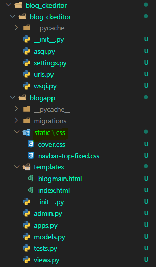  

---

## 4. App - view 만들기

요청이 들어오면 home.html 파일을 열어주는 함수를 blog 폴더 내부에 `views.py`파일에 작성해봅시다.

```python
from django.shortcuts import render

def index(request):
    return render(request, 'index.html')

def blogMain(request):
    return render(request, 'blogMain.html')
```

---

## 5. URLconf 연결

다음은 url을 연결해주어야 합니다.

`urls.py` 파일을 열어 다음 내용을 추가하세요.

```python
from django.contrib import admin
from django.urls import path
import blogapp.views

urlpatterns = [
    path('admin/', admin.site.urls),
    path('', blogapp.views.index, name='index'),
    path('blogMain/', blogapp.views.blogMain, name='blogMain'),
]
```

---

## 6.static file 적용

부트스트랩 file을 static file로 만들어줘야겠죠.

이전 포스팅에서 다뤘기 때문에 바로 적용시킬게요!


```
# blog_ckeditor/settings.py
import os

# ...

STATICFILES_DIRS = [
    os.path.join(BASE_DIR, 'blogapp', 'static')
]

STATIC_ROOT = os.path.join(BASE_DIR, 'static')
```

### ⏹collectstatic 실행

```bash
$ python manage.py collectstatic
```

> 서버를 실행시켜 부트스트랩 적용이 잘 되었는지 한번씩 확인해보세요!

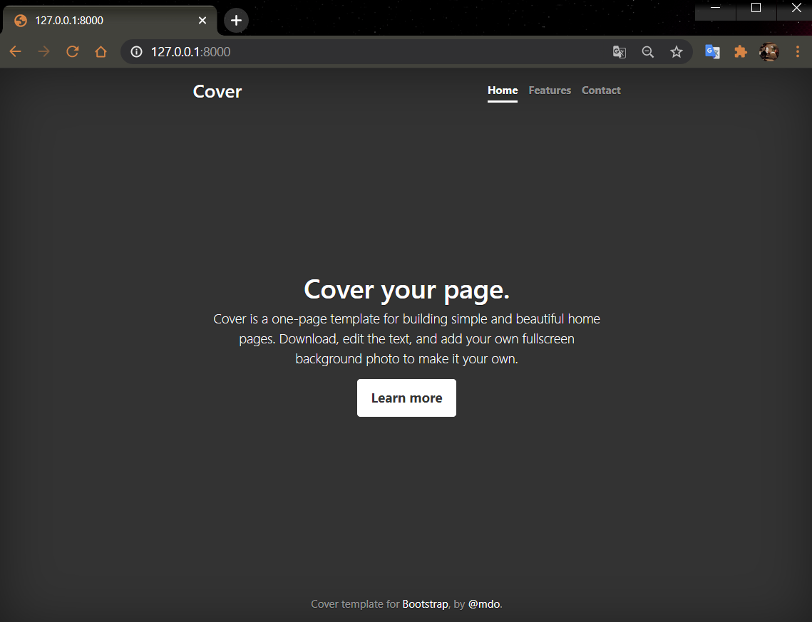  

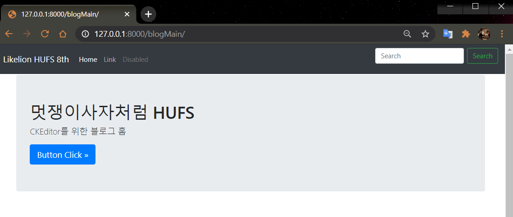

---

## 7.블로그 메인 컨텐츠 구성

- 글쓰기
- 로그인 기능
- 로그아웃 기능

> 로그인/로그아웃은 나중에 꼭 구현해보세요!

### ⏹index.html 수정

블로그에 들어올 때마다 주소에 계속 [http://127.0.0.1:8000/blogMain/]을 쳐서 들어오는 것은 번거로우니 링크를 걸어서 넘겨봅시다.

저는 가운데 [Learn more] 버튼을 누르면 메인 화면으로 넘어가도록 구성하겠습니다.


[index.html] 문서를 열고 다음과 같이 수정합니다.

```html
<a href="" class="btn btn-lg btn-secondary">Learn more</a>
```

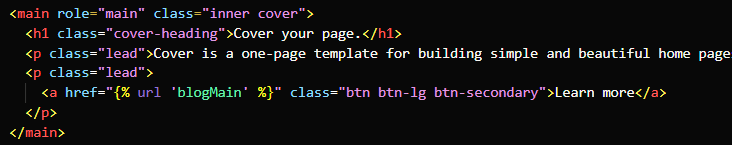

### ⏹blogMain.html 수정

블로그 메인 컨텐츠 기능대로 추가해보면 다음과 같습니다.

- cover로 돌아가는 링크
  
```html
<a class="navbar-brand" href="">Likelion HUFS 8th</a>
```

- 블로그 main 링크

```html
<a class="nav-link" href="">Home <span class="sr-only">(current)</span></a>
```

- 글쓰기, 로그인, 로그아웃 navbar

```html
<li class="nav-item">
    <a class="nav-link" href="#">글쓰기</a>
</li>
<li class="nav-item">
    <a class="nav-link" href="#">로그인</a>
</li>
<li class="nav-item">
    <a class="nav-link" href="#">로그아웃</a>
</li>
```

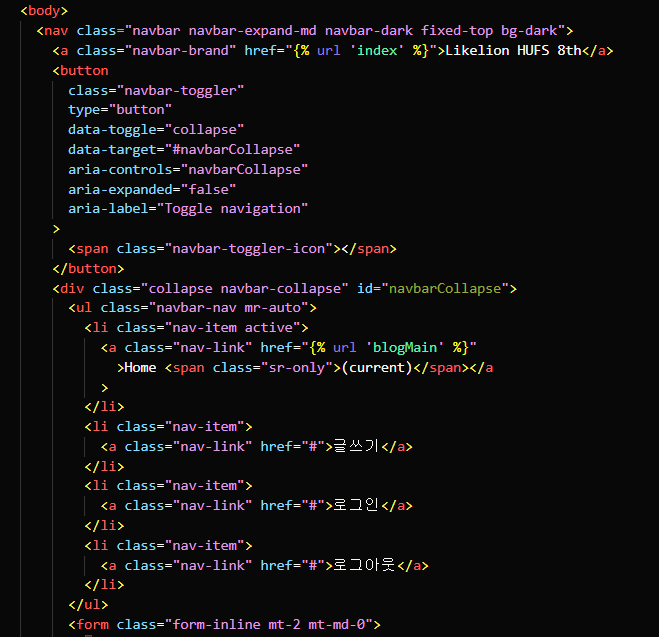

---

## 8. App - models.py 작성

블로그 작성할 데이터베이스 데이터를 똑같이 적용합니다.

- 제목
- 내용
- 작성일자

blogapp 폴더 내에서 `models.py`를 열어

아래와 같은 코드를 작성해 줍니다.

```python
from django.db import models

class Blog(models.Model):
    title = models.CharField(max_length=100)
    pub_date = models.DateTimeField()
    body = models.TextField()
```

---

## 9. Database migration

database 모델을 작성한 이후에는 항상 다음 과정을 거쳐야 합니다.

1. `models.py`에서 코드 작성
2. `python manage.py makemigrations` 을 통해 migration 만들기
3. `python manage.py migrate` 을 통해 데이터베이스에 적용하기

```bash
$ python manage.py makemigrations
$ python manage.py migrate
```

---

## 10. Admin 생성

블로그 게시글을 관리하는 관리자`admin`를 만들어주는 코드를 작성해봅시다.

```bash
$ python manage.py createsuperuser
```

- 이름
- 이메일
- 비밀번호
- 비밀번호 확인

---

## 11. Admin에 model 등록하기

blog 폴더 안으로 들어가서 admin.py를 수정합니다.

```python
from django.contrib import admin
from .models import Blog

# Register your models here.
admin.site.register(Blog)
```
---

## 12. Admin page에서 게시글 작성하기

- [http://127.0.0.1:8000/admin](http://127.0.0.1:8000/admin)로 접속
- blog 게시글 작성

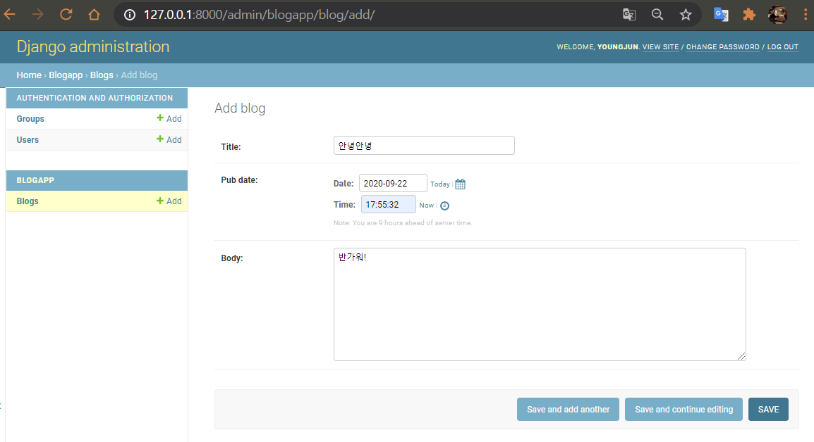

---

## 13. view로 데이터 가져오기

model을 만들고 그 안에 데이터도 넣었으면 이걸 `template`으로 보내 보여줘야 합니다.

그런데 model에서 template으로 바로 내용을 보낼수는 없고 항상 `view`를 거쳐서 보냅니다.

이번엔 `form`을 따로 작성해 모델의 항목을 가져오는 작업을 해보아요.

> `form` 에서 글쓰기에 사용할 폼을 만들고 `템플릿`으로 생성할겁니다.

### ⏹forms.py 만들기

```python
# blogapp/forms.py 생성!

from django import forms
from .models import Blog

class CreateBlog(forms.ModelForm):
    class Meta:
        model = Blog

        fields = ['title', 'pub_date', 'body']
```

### ⏹템플릿과 view 랜더링

#### createBlog.html

- `/blogapp/templates/createBlog.html` 생성

#### urls.py

- `blog_ckeditor/urls.py` 수정

```python
from django.contrib import admin
from django.urls import path
import blogapp.views

urlpatterns = [
    path('admin/', admin.site.urls),
    path('', blogapp.views.index, name='index'),
    path('blogMain/', blogapp.views.blogMain, name='blogMain'),
    path('blogMain/createBlog/', blogapp.views.createBlog, name='createBlog'),
]

```

#### blogMain.html 연결

- `blogapp/blogMain.html` 수정

```html
<li class="nav-item">
    <a class="nav-link" href="">글쓰기</a>
</li>
```

#### views.py 수정

- `blogapp/views.py` 수정

```python
from django.shortcuts import render
from .forms import CreateBlog

def index(request):
    return render(request, 'index.html')

def blogMain(request):
    return render(request, 'blogMain.html')

def createBlog(request):
    form = CreateBlog()
    return render(request, 'createBlog.html', {'form' : form})
```

- [blogapp]-[views.py]에서 [createBlog] 함수를 다음과 같이 수정합니다.
- 불러들인 폼을 [createBlog.html]으로 보내기 위해 [form]이라는 객체를 생성하고 보내줍니다.
- 지금까지는 render(request, '템플릿') 형식으로 사용하였지만, 여기서는 세번째 인자가 하나 더 추가된 것을 볼 수 있습니다.
- 세번째 인자는 [context]를 보내는 것이며, 딕셔너리 자료형의 형태를 가집니다. 이는 [createBlog.html] 문서에 딕셔너리 자료형을 보내게 되고, [createBlog.html]에서는 장고 템플릿 변수를 이용하여 값을 출력할 수 있게 됩니다.

---

### ⏹createBlog.html 수정하기

- 위에서 딕셔너리 자료형으로 [form]이라는 객체를 전달하였으므로 키 값 'form'을 이용하여 출력해봅시다.
html 문서에서 출력할 때에는 장고 템플릿 변수를 이용하여 출력합니다.
- 형태는 {{ }} 와 같은 형식을 이용합니다.
객체를 가져오기 때문에 상황에 따라 장고 템플릿을 활용하여 사용할 수 있습니다.

- 우리는 일단 그냥 값을 출력해보도록 합시다.

```html
<html lang="en">
<head>
    <meta charset="UTF-8">
    <title>Form</title>
</head>
<body>
    {{ form.as_p }}
</body>
</html>
```

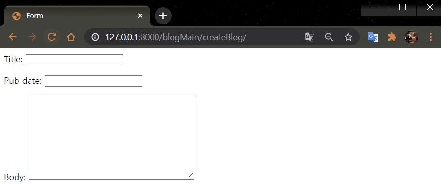

---

## 14. Templates - DB 연동

- 지금까지 한 작업들을 데이터베이스 모델 생성 이후부터 정리하여봅시다.

1) 데이터베이스 모델을 생성
2) 그 모델을 기반으로 하여 폼을 생성
3) 뷰에서 위의 폼을 불러 들이고 템플릿에 전달
4) 템플릿에서 화면에 출력

- 이제부터 해야되는 작업은 템플릿에서 데이터를 입력했을 때, 이 데이터들이 실제 데이터베이스에 저장이 되어야하는 작업입니다.

- 관리자 페이지에서는 단지 [Save] 버튼만 누르면 저장이 되었지만, 지금하고 있는 작업들은 관리자 페이지가 아니기 때문에 직접 설정해주어야 합니다.

### ⏹createBlog.html 수정

- 현재 [createBlog.html] 문서에는 단지 폼을 출력하는 코드만이 있을 뿐입니다.
- 물론 지금도 폼을 그대로 가져왔기 때문에 데이터를 입력할 수는 있습니다만 이 데이터를 전달할 수 있는 방법이 없습니다.
- html에서는 사용자들이 데이터를 입력하고 그 데이터를 전송하기 위해 <form> 태그를 이용하기 때문에 우리도 이를 활용하여 데이터 전달 폼을 구축해보도록 합시다.

```html
<form method="POST">
    {{ form.as_p }}
    <input type="submit" value="저장"/>
</form>
```

### ⏹views.py - createBlog() 수정

[blogapp]-[views.py]로 돌아와서 createBlog() 함수를 수정하여 제대로 DB에 저장하도록 수정합니다.

```python
from django.shortcuts import render, redirect
from .forms import CreateBlog

def index(request):
    return render(request, 'index.html')

def blogMain(request):
    return render(request, 'blogMain.html')

def createBlog(request):
 
    if request.method == 'POST':
        form = CreateBlog(request.POST)
 
        if form.is_valid():
            form.save()
            return redirect('blogMain')
        else:
            return redirect('index')
    else:
        form = CreateBlog()
        return render(request, 'createBlog.html', {'form': form})
 
    # form = CreateBlog()
    # return render(request, 'createBlog.html', {'form': form})
```

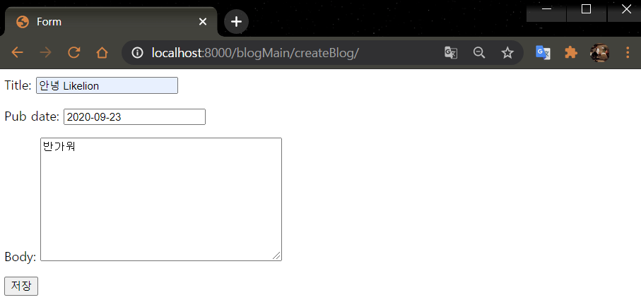

에러가 난다.

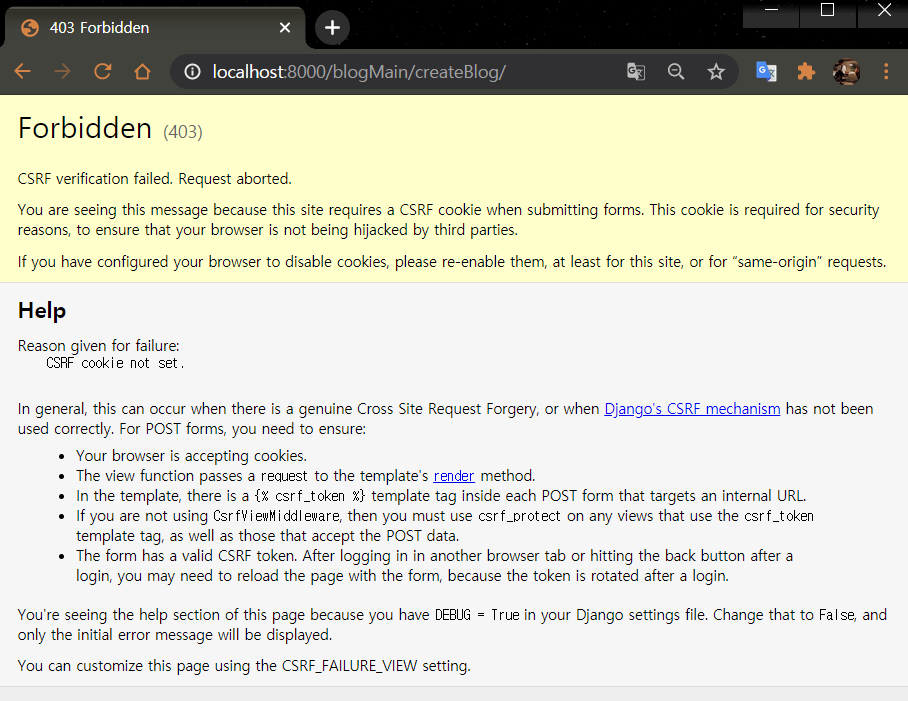

### ⏹csrf_token

Django는 `POST` 데이터 전달 과정에서 보안을 위해 `csrf_token`이 없으면 에러를 출력하도록 처리 되어있습니다.

> 참고) [CSRF(Cross-Site Request Forgery)란?](https://ko.wikipedia.org/wiki/) - 사이트_간_요청_위조

한 줄을 더 추가해주면 해결됩니다.

```html

```

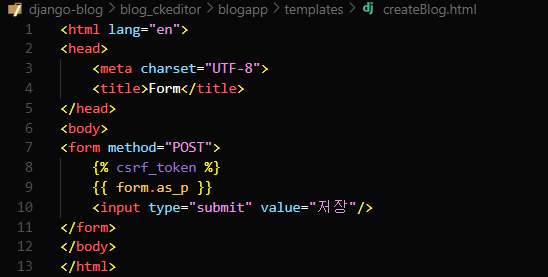

추가해주고 Admin 페이지에서 잘 저장된 것을 확인할 수 있습니다.

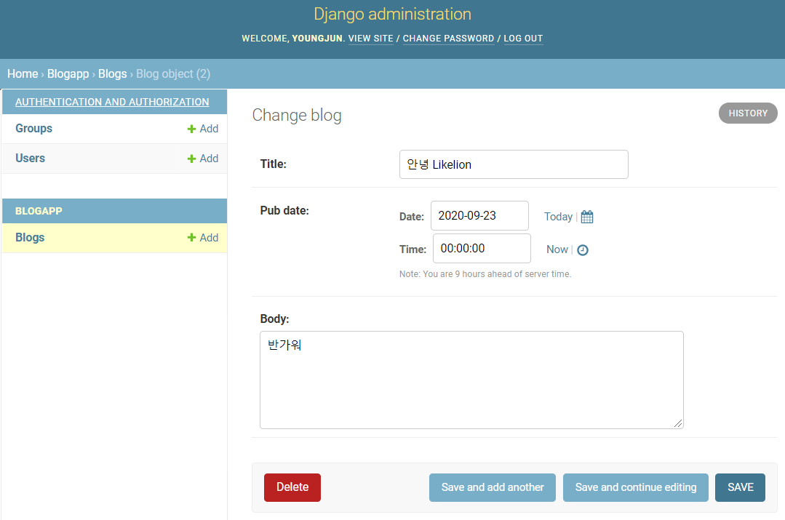

## 15.Template 상속

이전 세션에서 많이 다루었기 떄문에 적용만 하고 넘어갈게요! 

글쓰기 페이지도 부트스트랩 템플릿을 상속받아서 작성하려고 합니다.

- `blog_ckeditor/templates` 생성
- base.html 생성
- blogMain.html 내용 base.html로 복붙

우리가 필요한 공통 부분인 `nav`부분을 base로 묶으면 됩니다.

`base.html` 내용

```html

<head>
  <link
    rel="stylesheet"
    href="https://stackpath.bootstrapcdn.com/bootstrap/4.5.2/css/bootstrap.min.css"
    integrity="sha384-JcKb8q3iqJ61gNV9KGb8thSsNjpSL0n8PARn9HuZOnIxN0hoP+VmmDGMN5t9UJ0Z"
    crossorigin="anonymous"
  />
  <link rel="stylesheet" href="" />
</head>
<body>
  <nav class="navbar navbar-expand-md navbar-dark fixed-top bg-dark">
    <a class="navbar-brand" href="">Likelion HUFS 8th</a>
    <button
      class="navbar-toggler"
      type="button"
      data-toggle="collapse"
      data-target="#navbarCollapse"
      aria-controls="navbarCollapse"
      aria-expanded="false"
      aria-label="Toggle navigation"
    >
      <span class="navbar-toggler-icon"></span>
    </button>
    <div class="collapse navbar-collapse" id="navbarCollapse">
      <ul class="navbar-nav mr-auto">
        <li class="nav-item active">
          <a class="nav-link" href=""
            >Home <span class="sr-only">(current)</span></a
          >
        </li>
        <li class="nav-item">
          <a class="nav-link" href="">글쓰기</a>
        </li>
        <li class="nav-item">
          <a class="nav-link" href="#">로그인</a>
        </li>
        <li class="nav-item">
          <a class="nav-link" href="#">로그아웃</a>
        </li>
      </ul>
      <form class="form-inline mt-2 mt-md-0">
        <input
          class="form-control mr-sm-2"
          type="text"
          placeholder="Search"
          aria-label="Search"
        />
        <button class="btn btn-outline-success my-2 my-sm-0" type="submit">
          Search
        </button>
      </form>
    </div>
  </nav>


 


</body>

```

맨 아래는 다음과 같이

```html


```

상속 템플릿 키워드를 사용하면 됩니다.

이제 `blogMain.html` 과 `createBlog.html` 파일에 상속 키워드를 적어주면 됩니다.

`blogMain.html` 내용

```html



<main role="main" class="container">
  <div class="jumbotron">
    <h1>멋쟁이사자처럼 HUFS</h1>
    <p class="lead">CKEditor를 위한 블로그 홈</p>
    <a
      class="btn btn-lg btn-primary"
      href="{{ site.baseurl }}/docs/{{ site.docs_version }}/components/navbar/"
      role="button"
      >Button Click &raquo;</a
    >
  </div>
</main>


```

`createBlog.html` 내용

```html


<!DOCTYPE html>
<html lang="en">
  <head>
    <meta charset="UTF-8" />
    <title>Form</title>
  </head>
  <body>
    <form method="POST">
       {{ form.as_p }}
      <input type="submit" value="저장" />
    </form>
  </body>
</html>


```

서버를 돌려보면 정상적으로 적용된 것을 확인할 수 있습니다.

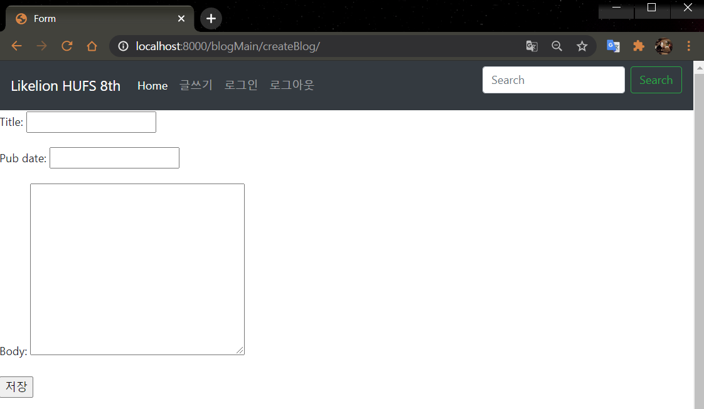

---

여기까지 리마인드 및 기본 설정 끝!