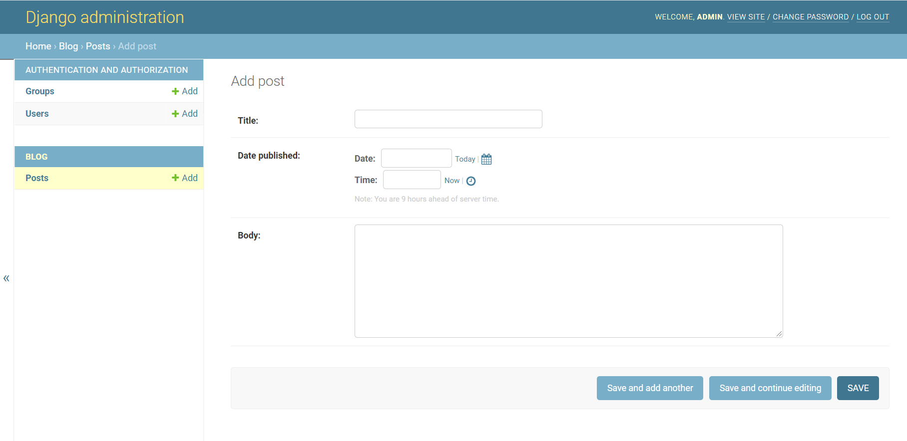
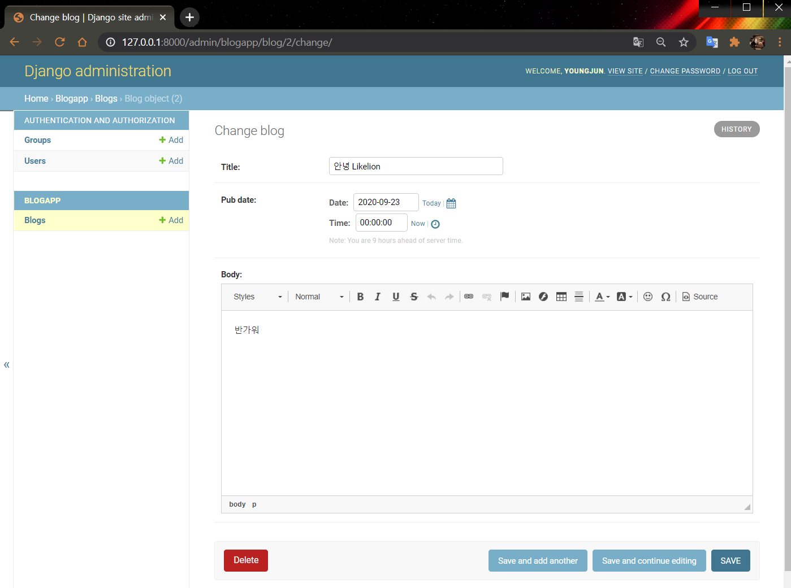

# CKEditor 텍스트 에디터
  
  
  
#### 🧱Preference

> Windows10  
> python 3.7 이상  
> Git Bash  
> Django 기본 구조

---

#### ✍ 이전 blog 프로젝트

CKEditor를 활용하고 쉽게 적용하기 위해 리마인드 & 프로젝트 설정을 위한 [Blog App](https://jun108059.github.io/django-blog/CKEditor/00.ckeditor.html)의 구성(form, static 경로 설정 등)이 필요합니다.

읽어보시고 기존 프로젝트에 적용해보셔도 좋습니다!

#### Directory 구조

```shell script
blog_ckeditor
├── blog_ckeditor
│   ├── templates
│   │   └── base.html
│   ├── __init__.py
│   ├── settings.py
│   ├── urls.py
│   └── views.py
├── blogapp
│   ├── templates
│   │   └── blogMain.html
│   │   └── createBlog.html
│   │   └── index.html
│   ├── static/css
│   │   └── cover.css
│   │   └── navbar-top-fixed.css
│   ├── __init__.py
│   ├── admin.py
│   ├── apps.py
│   ├── migrations
│   │   └── __init__.py
│   ├── models.py
│   ├── tests.py
│   ├── urls.py
│   ├── forms.py
│   └── views.py
├── db.sqlite3
├── manage.py
└── static
    ├── admin
    │   └── css
    │   └── fonts
    │   └── img
    │   └── js
    ├── css
    │   └── cover.css
    └── └── navbar-top-fixed.css
```

---

## 1. CKEditor

이번 Session에서는 관리자 기능을 좀 더 잘 활용할 수 있는 기능을 추가해보려고 합니다.

기존에 `Text Area`의 Body 에 글자를 예쁘게 꾸밀 수 있는 텍스트 편집기를 추가할 수 있는 `CKEditor`를 알아봅시다.

CKEditor는 `WYSIWYG` 방식의 텍스트 편집기입니다.

### ⏹WYSIWYG?

위지위그라고 읽으며 What You See Is What You Get 의 줄임말로서 '보는대로 얻는다' 라는 의미입니다.

블로그나 웹 페이지에서 글을 쓸 때, 눈에 보이는 글씨의 모양 그대로 문서 편집을 할 수 있는 것을 말합니다.

참고) [CKEditor란?](https://ko.wikipedia.org/wiki/CKEditor)

CKEditor는 대부분의 브라우저에서 지원합니다.

이 툴을 이용하면 간단하게 문서 편집 기능을 사용자에게 제공할 수 있습니다.

  

기존의 밋밋한 Admin Text Area

---

## 2. CKEditor Tool 설치 및 등록

터미널에 설치 명령어를 입력합니다.

```bash
$ pip install django-ckeditor
```

`[projectFolder]-[settings.py]`

```python
INSTALLED_APPS = [
    'django.contrib.admin',
    'django.contrib.auth',
    'django.contrib.contenttypes',
    'django.contrib.sessions',
    'django.contrib.messages',
    'django.contrib.staticfiles',
    'blogapp.apps.BlogappConfig',
    'ckeditor', # Add
]
```

### ⏹models.py 적용

```python
from django.db import models
from ckeditor.fields import RichTextField

class Blog(models.Model):
    title = models.CharField(max_length=100)
    pub_date = models.DateTimeField()
    # body = models.TextField()
    body = RichTextField()
    
```

### ⏹migration

```bash
$ python manage.py makemigrations
$ python manage.py migrate
```

---

## 3. Static files

이전 Session에서 적용했던 Static file에 관한 Setting이 선행되어야 CKEditor를 사용할 수 있습니다!

리마인드하며 다시 static file만 적용시켜봅시다.

> 이전 포스팅을 그대로 따라오셨다면 생략하셔도 좋아요!

### ⏹setting.py - Static 파일 경로 알려주기

settings.py에 가서 아래 코드를 추가해주세요.

```python
import os

# ... 생략

STATICFILES_DIRS = [
    os.path.join(BASE_DIR, 'blogapp', 'static')
]

STATIC_ROOT = os.path.join(BASE_DIR, 'static')
```

## 4. collectstatic 관리 실행

```bash
$ python manage.py collectstatic
```

static file에 대한 경로를 정확히 명시해주고 위 명령어를 실행하면 Django는 생성된 프로젝트 폴더에 `static` 폴더를 자동으로 생성해줍니다.

---

## 5. Admin Page에서 확인

  


이제 Text Area를 `CKEditor`의 Text Field로 바꿔봅시다.

`/blog/models.py/`

```python
from django.db import models
from ckeditor.fields import RichTextField # Add

class Post(models.Model):
    title = models.CharField(max_length=200)
    pub_date = models.DateTimeField('date published')
    # body = models.TextField()
    body = RichTextField() # Add

    def __str__(self):
        return self.title
```

예쁘게 텍스트를 편집할 수 있는 에디터가 보이면 성공입니다.

---

#### Reference

- https://github.com/django-ckeditor/django-ckeditor
- https://jamanbbo.tistory.com/43 
- https://opentutorials.org/module/4034/24908

---