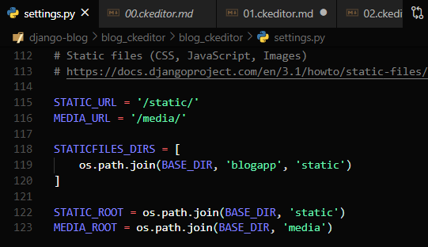
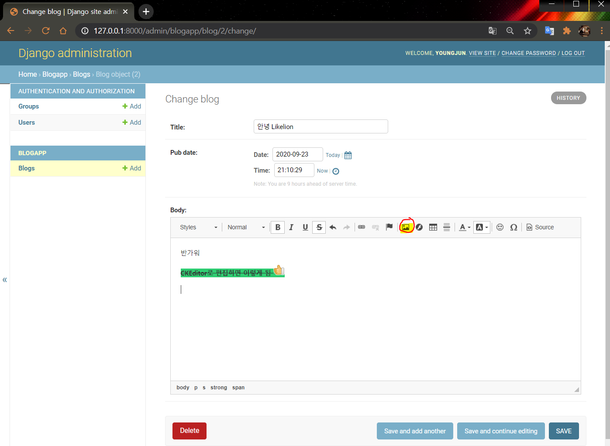
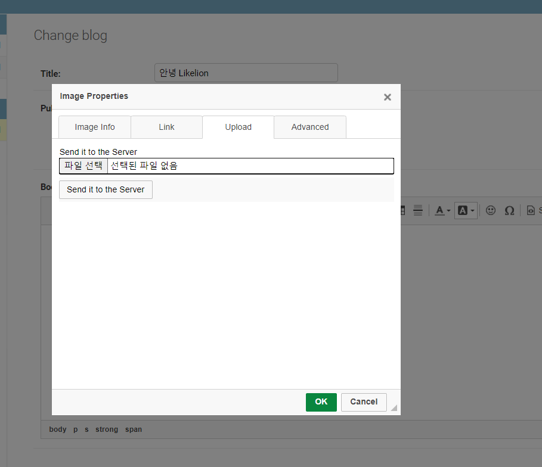
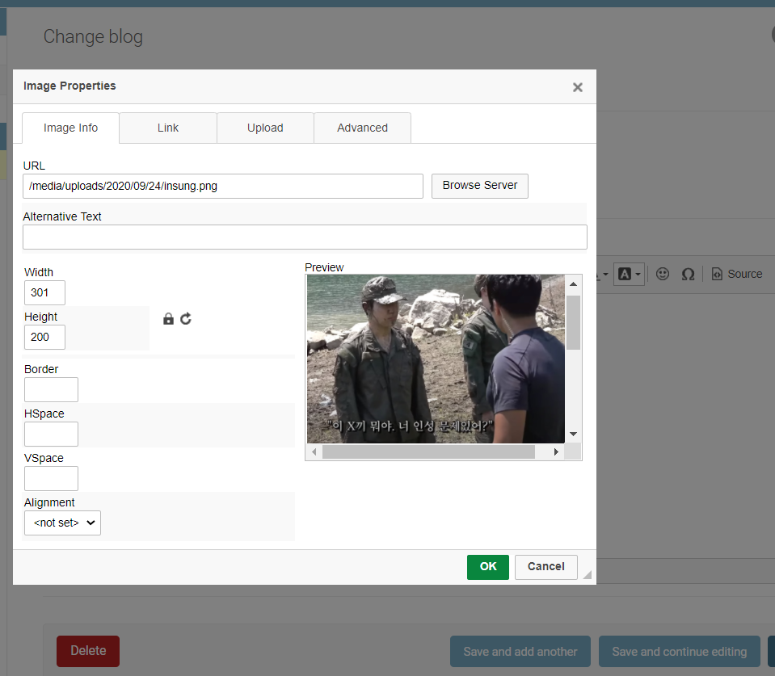
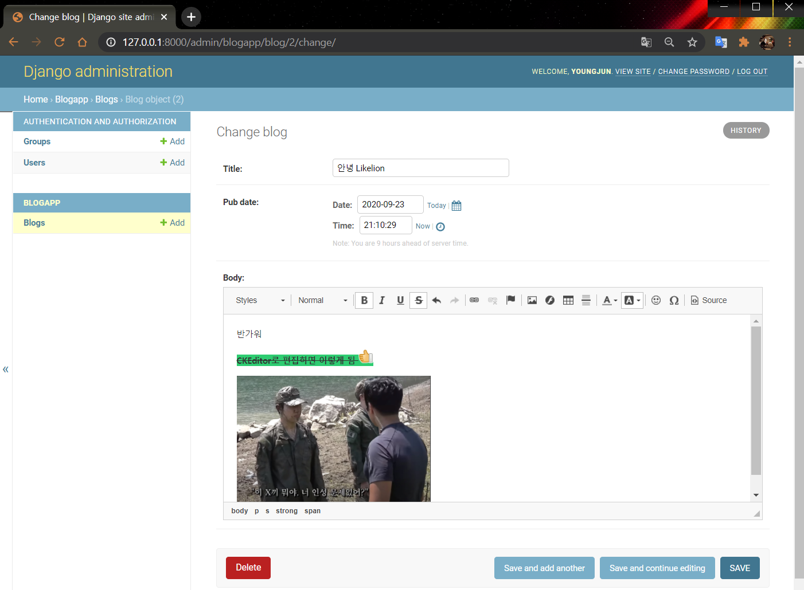

# CKEditor 이미지 파일 업로드
  
  
  
#### 🧱Preference

> Windows10  
> python 3.7 이상  
> Git Bash  
> Django 기본 구조

---

## 1. 이미지 uploader 설정

- 이미지 파일을 업로드하려면 uploader를 설정해야합니다.

`blog_ckeditor/settings.py`

```python
INSTALLED_APPS = [
    # ... 생략
    'blogapp.apps.BlogappConfig',
    'ckeditor',
    ​'ckeditor_uploader', # Add
]
```

바로 아래에 업로드 파일의 경로도 지정해줍니다.

```python
CKEDITOR_UPLOAD_PATH = "uploads/"
CKEDITOR_IMAGE_BACKEND = "pillow"
```

맨 아래에 `media` 파일을 분류할 수 있는 root 설정도 해줍니다.

```python
MEDIA_URL = '/media/'
MEDIA_ROOT = os.path.join(BASE_DIR, 'media')
```

  

---

## 2. url 추가하기

`blog_ckeditor/urls.py`

```python
from django.contrib import admin
from django.urls import path
import blogapp.views
from django.conf.urls import include # Add
from django.conf import settings # Add
from django.conf.urls.static import static # Add

urlpatterns = [
    path('admin/', admin.site.urls),
    path('', blogapp.views.index, name='index'),
    path('blogMain/', blogapp.views.blogMain, name='blogMain'),
    path('blogMain/createBlog/', blogapp.views.createBlog, name='createBlog'),
    path('ckeditor/', include('ckeditor_uploader.urls')), # Add
]+ static(settings.MEDIA_URL, document_root=settings.MEDIA_ROOT) # Add
```

## 3. models.py 수정하기

[models.py]에서 파일 업로드 필드로 적용시키기 위해 다음과 같이 수정합니다.

`blogapp/models.py`

```python
from django.db import models
# from ckeditor.fields import RichTextField
from ckeditor_uploader.fields import RichTextUploadingField

class Blog(models.Model):
    title = models.CharField(max_length=100)
    pub_date = models.DateTimeField()
    # body = models.TextField()
    # body = RichTextField()
    body = RichTextUploadingField()
```

## 4. migration

```bash
$ python manage.py makemigrations
$ python manage.py migrate
```

## 5. Admin 확인하기

Admin page에서 이미지 업로드가 잘 되는지 확인해봅시다.



버튼을 누르면 다음 창이 뜰거에요.



파일을 선택하고 `Send it to Server` 버튼을 눌러보면



이렇게 이미지를 편집할 수 있게 됩니다.

크기를 조절해서 넣어볼게요.



이렇게 글에 이미지가 포함된 것을 확인할 수 있습니다.

저장하면 저희가 설정한대로 `media/uploads` 폴더에 잘 저장되는 것을 확인할 수 있습니다!


---

#### Reference

- https://github.com/django-ckeditor/django-ckeditor
- https://jamanbbo.tistory.com/43 
- https://opentutorials.org/module/4034/24908

---