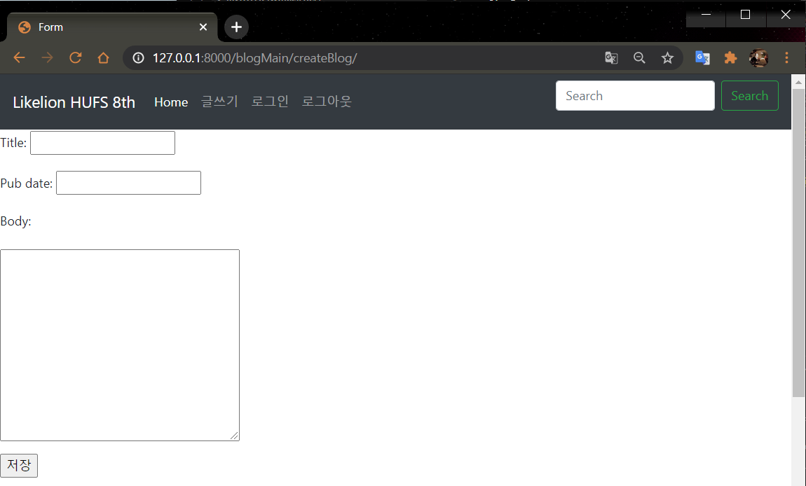
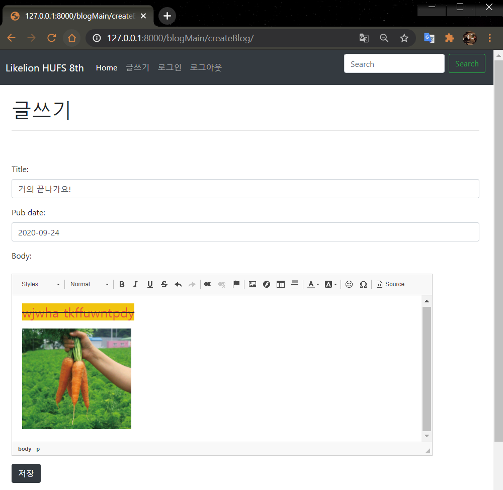
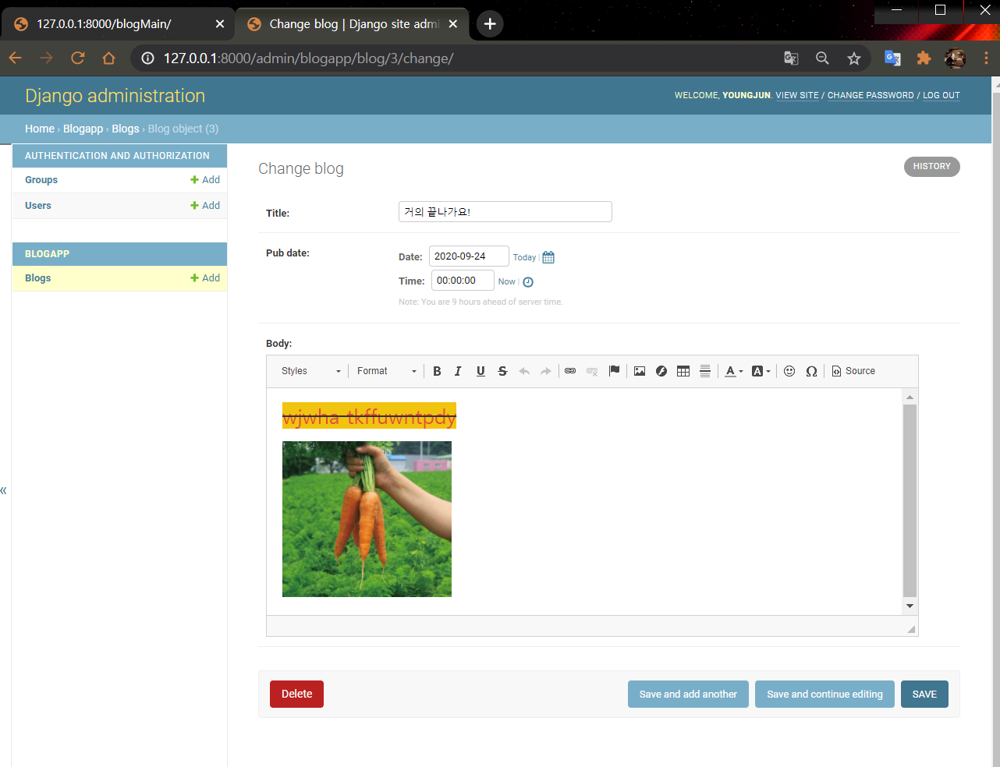
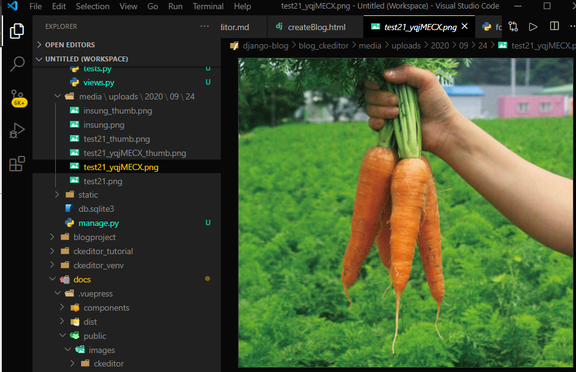

# User 글쓰기 페이지 적용
  
  
  
#### 🧱Preference

> Windows10  
> python 3.7 이상  
> Git Bash  
> Django 기본 구조

---

## 1. 현재 글쓰기 페이지

- CKEditor를 활용해서 Admin pagep에서 이미지 업로딩 기능까지 구현하였습니다.
- 글쓰기 페이지에 적용해보도록 합시다.



▲ 기존 페이지

## 2. forms.py 수정

`blogapp/forms.py`

```python
from django import forms
from .models import Blog
from ckeditor_uploader.widgets import CKEditorUploadingWidget


class CreateBlog(forms.ModelForm):
    class Meta:
        model = Blog
 
        fields = ['title', 'pub_date', 'body'] 

        widgets = {
            'title': forms.TextInput(
                attrs={'class': 'form-control', 'style': 'width: 100%', 'placeholder': '제목을 입력하세요.'}
            ),
            'pub_date': forms.TextInput(
                attrs={'class': 'form-control', 'style': 'width: 100%', 'placeholder': '작성일짜를 입력하세요.'}
            ),
            'body': forms.CharField(widget=CKEditorUploadingWidget()),
        }
]
```

- 'widgets'을 지정하면, 장고에서 자체적으로 제공하는 폼의 형태를 빌려올 수 있습니다.
- 'title','pub_date'  TextInput가 형태를 적용하였습니다.
- 'body'는 CKEditor 자체만의 위젯이 제공을 하므로 [CKEditorUploadingWidget]을 import하여 적용시켜주었습니다.

- 그 안의 속성('attrs=')으로 폼에 적용되는 css의 class를 지정해 주었습니다.
이는 제가 나름대로 [getbootstrap documentation]에서 각각 html에 맞는 class를 찾아서 적용한 것이므로 다르게 적용시켜도 됩니다.

[https://getbootstrap.com/](https://getbootstrap.com/)

## 3. createBlog.html 수정

css를 적용해서 원하시는대로 꾸미시면됩니다.

- 여기에서 중요한 부분은 form 태그의 'enctype'과 {{ form.media }}입니다.

- enctype="multipart/form-data"를 설정해주어야 문자 이외의 이미지 파일 같은 것들도 같이 묶여서 전송이 됩니다.

- 또한 {{ form.media }}를 넣어 주어야 CKEditor의 폼이 적용이 됩니다.

`blogapp/templates/createBlog.html`

```html

 

 
    <br>
    <div class="container">
        <h1>글쓰기</h1>
        <hr>
        <br><br>
        <form method="POST" enctype="multipart/form-data">
            
            {{ form.media }}
            {{ form.as_p }}
            <input type="submit" class="btn btn-dark" value="저장"/>
        </form>
    </div>
 

```

## 4. 적용 확인

서버를 돌리고 확인해봅시다!



예쁘게 바뀐 글쓰기 form과 함께 `CKEditor`도 잘 적용된 것을 확인할 수 있습니다.

저장 후 admin에서도 확인해보아요.



media 폴더에도 정상적으로 저장되는 것을 확인할 수 있습니다.



---

#### Reference

- https://github.com/django-ckeditor/django-ckeditor
- https://jamanbbo.tistory.com/43 
- https://opentutorials.org/module/4034/24908

---
