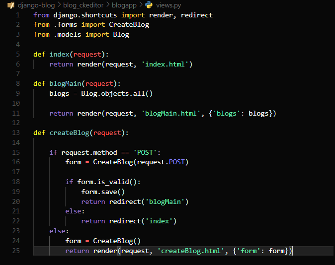
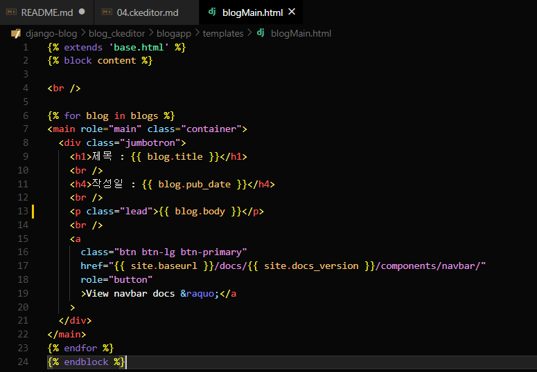
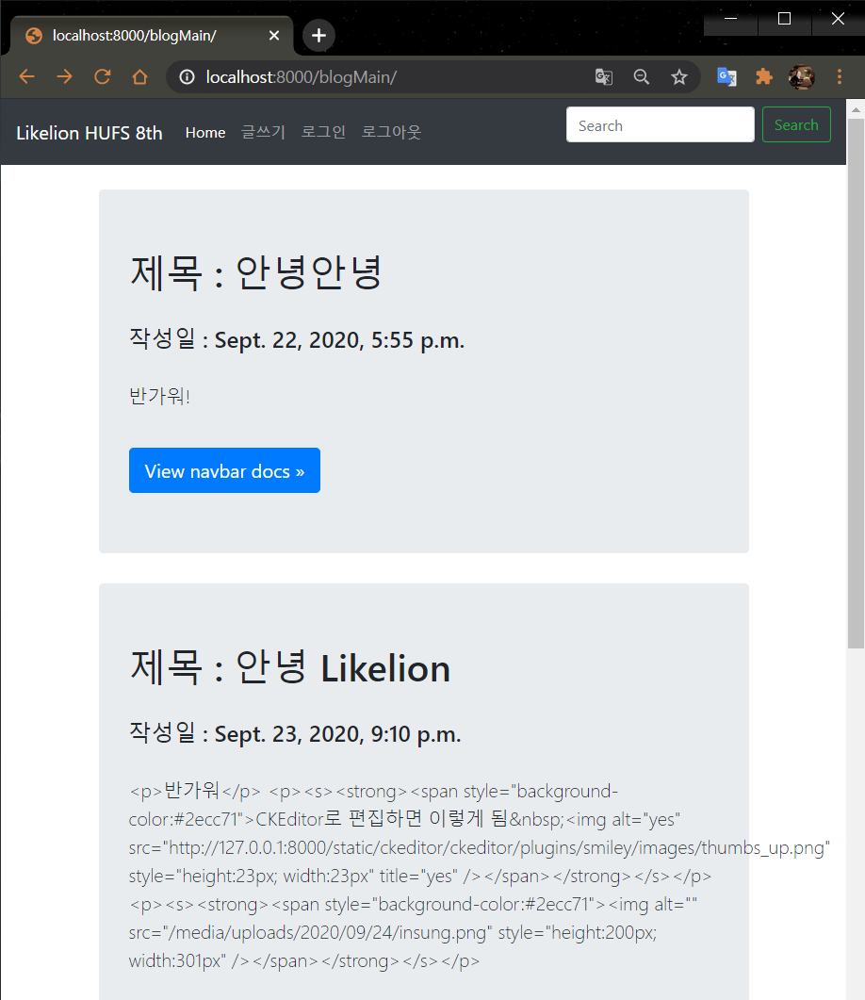
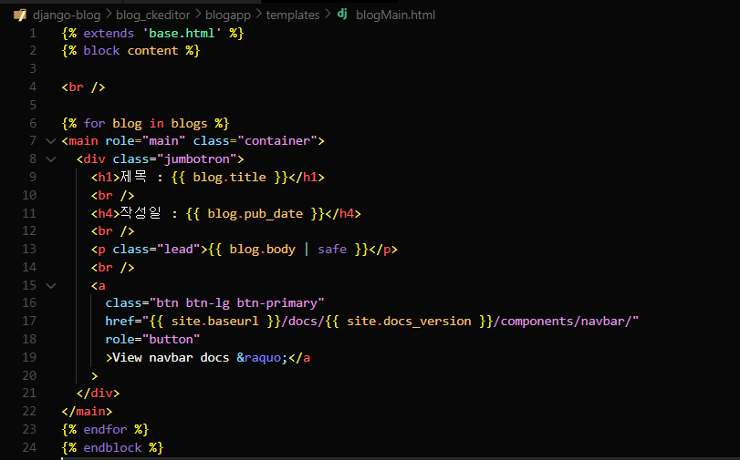
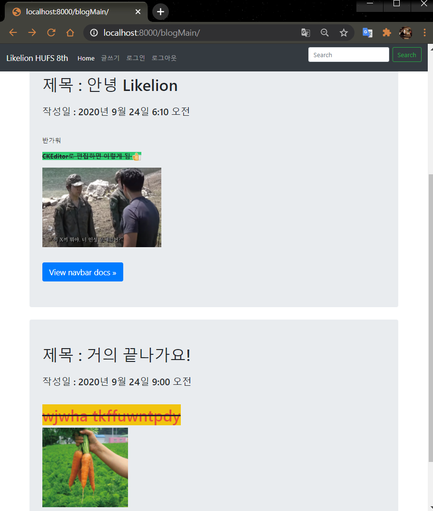

# 블로그 메인 화면 출력
  
  
  
#### 🧱Preference

> Windows10  
> python 3.7 이상  
> Git Bash  
> Django 기본 구조

---

## 1. 블로그 메인 page로 보기

- Admin 말고 메인 page로 렌더링해서 출력해봅시다.

### ⏹views.py 수정

`blogapp/views.py`에서 blogMain()함수를 다음과 같이 수정하여 줍니다.

```python
from .models import Blog
 
def blogMain(request):
    blogs = Blog.objects.all()
 
    return render(request, 'blogMain.html', {'blogs': blogs})
```



---

### ⏹blogMain.html 수정



- 'blogs' 객체 넘긴 것을 템플릿 태그 중 for를 사용하여 반복문을 돌면서 하나씩 블로그 객체를 반환합니다.

- 하나씩 블로그 객체의 제목, 작성일, 내용을 템플릿 변수를 사용하여 출력합니다.

## 2. 1차 작동 확인



제목은 괜찮은데 body에 html 태그가 제대로 적용되지 않는 것으로 보입니다.

## 3. body 수정

- 장고는 기본적으로 <, >, &, ", ' 등의 문자를 자동적으로 'auto-escape' 합니다.
- 하지만, 이는 모든 것에 적용이 되는 것은 아니므로 이런 상황일 경우 다음과 같이 해결합니다.
- 장고 템플릿 필터 중 'safe'를 사용하여 해결합니다.

`{{ | safe }}` 추가하기



## 4. 2차 작동 확인



짝짝짝 정상적으로 출력됩니다!

---

#### Reference

- https://github.com/django-ckeditor/django-ckeditor
- https://jamanbbo.tistory.com/43 
- https://opentutorials.org/module/4034/24908

---
