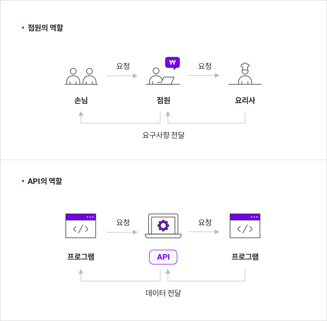

# REST, RESTful API란?
  
  
  
#### 🧱Preference

> Windows10  
> python 3.7 이상  
> Git Bash  
> Django 기본적인 개념  
> HTTP Method  

---

**✍ 공부를 하기에 앞서**

다소 개념적인 내용이 많아요. 완벽히 이해하지 못해도 실습을 하면서

실제로 REST를 구현해본 이후, 다시 읽어보면 더 이해가 잘 되실거라 생각합니다!

---

## 왜 배워야해요?

지금까지 만들었던 Django app들도 서비스하기에 큰 무리가 없어보이는데

왜 RESTful API를 배워야하는지, REST는 뭔지, 하다못해 API는 뭔지도 정확히 모르겠습니다.

RESTful API가 필요한 간단한 이유는 우리가 만들 애플리케이션이나 시스템의 규모가 커지면 커질수록,

사용자(클라이언트)가 많아질수록 `통합, 분리, 관리`를 쉽게 할 수 있기 때문입니다.

---

## API는 뭐에요?

그럼 가장 기본적인 **API**를 이해해볼게요!

### ⏹ 도서 판매 회사 - 서점 직원

한가지 예를 들어보면 도서를 유통하는 회사가 있다고 생각해봅시다.

이 도서 유통업체에서 각 고객에게 *애플리케이션*을 **제공**하여 서점 직원이 유통 업체의

**도서 재고**를 확인하도록 할 수도 있지만, 애플리케이션을 개발하는데 많은 비용과 시간이

들고 플랫폼의 제약을 받을 수 있으며 지속적인 유지관리가 필요하겠죠.

이런 상황에 **재고 확인용 API**를 제공하는 것입니다. 

이 API를 통하면 도서 유통업체에서 각 다른 서점 직원이 **재고 확인**이라는 기능을

효율적으로 제공하고 관리할 수 있게 됩니다.

---

### ⏹ 음식점의 손님 - 요리사

더 쉬운 예를 들어봅시다.

여러분이 레스토랑에 있다고 가정해봅시다.

요리를 하시는 요리사분이 직접 주문을 받고 요리도 한다고 가정하면

주문이 많이 밀리겠죠? 그래서 실제 레스토랑에는 점원이 존재합니다.

  
(▲ 출처 : http://blog.wishket.com/)

1. `점원`이 주문을 받아 `요리사`에게 요청
1. `요리사`는 음식을 만들어서 `점원`에게 전달
1. `점원`은 `손님`에게 주문한 음식을 제공 

여기서 점원은 `API`와 같은 역할을 합니다.

API는 손님(프로그램)이 주문할 수 있게 메뉴(명령 목록)를 정리하고, 
주문(명령)을 받으면 요리사(응용프로그램)와 상호작용하여 요청된 메뉴(명령에 대한 값)를 전달합니다.

쉽게 말해, **API는 프로그램들이 서로 상호작용하는 것을 도와주는 매개체**로 볼 수 있습니다.

---

**API : Application Programmin Interface**

조금 더 프로그래머 다운 예시를 들면 `카카오 알림톡`을 생각해보시면 좋을 것 같아요.

주문 알림, 청구서, 예약 알림, 배송 알림 등 여러 알림들이 요즘은 카카오 알림톡을 통해

사용자에게 전송되는 것을 어렵지 않게 경험하실 수 있을거에요.

이렇게 많은 각기 다른 회사에서 모두 `카카오 알림톡`의 기능을 사용하는데

카카오는 알림톡 API를 잘 만들어 두었고, 사용하는 회사에서는 카카오 알림톡이 내부적으로 

어떻게 프로그래밍 되었는지, 통신 방식은 어떻게 되는지 등을 전혀 모르고 사용할 수 있습니다.

이처럼 API는 **누군가(카카오)가 만든 서비스를 다른 누군가(기업, 기관, 개인 개발자)에게**

**제공하여 기능, 프로그램을 사용할 수 있게끔 도와주는 중간 매개체** 로 바꾸어 얘기할 수 있습니다.

---

## REST는 뭐에요?

### ⏹ REST의 탄생

> 궁금하신 분들이 있을 것 같아 적어두었지만 그렇구나~ 하고 넘어가시면 됩니다!😃

REST는 Representational State Transfer라는 용어의 약자로서 2000년도에 
로이 필딩 (Roy Fielding)의 박사학위 논문에서 최초로 소개되었습니다. 

로이 필딩은 HTTP의 주요 저자 중 한 사람으로 그 당시 웹(HTTP) 설계의 우수성에 
비해 제대로 사용되어지지 못하는 모습에 안타까워하며 **웹의 장점을 최대한 활용**할 수 
있는 **아키텍처**로써 REST를 발표했다고 합니다.

---

### REST 란?

**Representational State Transfer**

REST는 **분산 시스템 설계**를 위한 **아키텍처 스타일**입니다.

아키텍처 스타일이라는건 쉽게 말하면 **제약 조건의 집합**이라고 보시면 됩니다.

자세한 설명은 아래에서 다시 살펴봅시다!

---

### ⏹ RSETful은요?

`RESTful`은 위의 제약 조건의 집합(아키텍처 스타일, 아키텍처 원칙)을 모두 만족하는 것을 의미합니다.

`REST`라는 **아키텍처 스타일**이 있는거고 `RESTful API`라는 말은 REST 아키텍처 원칙을 모두 만족하는 **API**라는 뜻입니다.

> 위와같이 분명한 차이가 있지만 `REST API` 와 `RESTful API`는 거의 같은 의미로 혼용되어 사용하고 있습니다.

<details><summary>**✍ REST 제약 조건이 궁금해요**</summary>
1) Uniform (유니폼 인터페이스)
Uniform Interface는 URI로 지정한 리소스에 대한 조작을 통일되고 한정적인 인터페이스로 수행하는 아키텍처 스타일을 말합니다.

2) Stateless (무상태성)
REST는 무상태성 성격을 갖습니다. 다시 말해 작업을 위한 상태정보를 따로 저장하고 관리하지 않습니다. 세션 정보나 쿠키정보를 별도로 저장하고 관리하지 않기 때문에 API 서버는 들어오는 요청만을 단순히 처리하면 됩니다. 때문에 서비스의 자유도가 높아지고 서버에서 불필요한 정보를 관리하지 않음으로써 구현이 단순해집니다.

3) Cacheable (캐시 가능)
REST의 가장 큰 특징 중 하나는 HTTP라는 기존 웹표준을 그대로 사용하기 때문에, 웹에서 사용하는 기존 인프라를 그대로 활용이 가능합니다. 따라서 HTTP가 가진 캐싱 기능이 적용 가능합니다. HTTP 프로토콜 표준에서 사용하는 Last-Modified태그나 E-Tag를 이용하면 캐싱 구현이 가능합니다.

4) Self-descriptiveness (자체 표현 구조)
REST의 또 다른 큰 특징 중 하나는 REST API 메시지만 보고도 이를 쉽게 이해 할 수 있는 자체 표현 구조로 되어 있다는 것입니다.

5) Client - Server 구조
REST 서버는 API 제공, 클라이언트는 사용자 인증이나 컨텍스트(세션, 로그인 정보)등을 직접 관리하는 구조로 각각의 역할이 확실히 구분되기 때문에 클라이언트와 서버에서 개발해야 할 내용이 명확해지고 서로간 의존성이 줄어들게 됩니다.

6) 계층형 구조
REST 서버는 다중 계층으로 구성될 수 있으며 보안, 로드 밸런싱, 암호화 계층을 추가해 구조상의 유연성을 둘 수 있고 PROXY, 게이트웨이 같은 네트워크 기반의 중간매체를 사용할 수 있게 합니다.
</details>

---

### ⏹ REST가 필요한 이유는요?

**1. 위에서 말한 것과 같이 분산 시스템을 위해서**

> 애플리케이션 복잡도가 증가하여 기능을 분산해야했다.

거대한 애플리케이션을 모듈, 기능별로 분리하기 쉬워집니다. 

RESTful API를 서비스하기만 하면 어떤 다른 모듈 또는 애플리케이션들이라도 

RESTful API를 통해 상호간에 통신을 할 수 있기 때문입니다!

**2. WEB브라우저 외의 클라이언트를 위해서(멀티 플랫폼)**

> Back-end 하나로 다양한 Device를 대응할 수 있다.

웹 페이지를 위한 HTML 및 이미지등을 보내던 것과 달리 이제는 데이터만 보내면 
여러 클라이언트에서 해당 데이터를 적절히 보여주기만 하면 됩니다.

예를 들어 모바일 애플리케이션으로 HTML 같은 파일을 보내는 것은 무겁고 브라우저가 
모든 앱에 있는 것은 아니기 때문에 알맞지 않았는데 RESTful API를 사용하면서 
데이터만 주고 받기 때문에 여러 클라이언트가 자유롭고 부담없이 데이터를 이용할 수 있게 됩니다.

서버도 요청한 데이터만 깔끔하게 보내주면되기 때문에 가벼워지고 유지보수성도 좋아집니다.

> ✍ 따라서 RESTful API를 활용하면 프론트와 백엔드가 완전히 분리될 수 있습니다!

---

위에서 설명한 멀티 플랫폼에 대해 자세한 설명이 있으니 이해가 어려우시면 읽어보세요!

<details>
<summary>**✍ 다양한 클라이언트의 등장에 대해**</summary>
스마트폰이 등장하기 전 IT 기업들은 웹 페이지를 보여주는 웹서버만 구현하면 됐습니다.
그 웹 서버에서 DB 서버의 데이터도 읽어오고 사용자들이 글을 남기면 DB 서버에 
저장까지 하는 기능을 모두 담당했죠. 하지만 스마트폰이 출시되고, 
어플리케이션의 등장으로 더이상 웹으로만 서비스를 제공하는 것에는 한계가 있었습니다.
  
따라서 HTML로 렌더링 하는 웹서버가 아닌, `JSON` 혹은 `XML` 과 같은 형식을 통해서 
데이터를 다루는 별도의 API 서버가 필요했습니다.
스마트폰 어플과 웹에서 동일한 기능을 제공하는데 기존의 웹서버를 계속 사용하면 
매번 HTML을 읽어서 해당 태그에 있는 정보를 찾아내는 일은 말도 안되는 일이기 때문입니다.
 
따라서 RESTful 아키텍쳐를 HTTP Method와 함께 사용해 웹, 데스크탑 앱, 
스마트폰 어플들까지 하나의 API 서버를 생성할 수 있습니다.
 
Django 또한 View 클래스 자체가 RESTful 한 서버를 만들기에 최적인 프레임워크입니다.
</details>

---

## REST의 기본

REST의 개념적인 내용은 위에서 다루었고, 기능적인 의미를 살펴보아야 합니다.

REST의 기능적인 의미는, 웹에 존재하는 모든 자원`(이미지, 동영상, DB 자원)`에 고유한 **URI**를 부여해 활용하는 것으로, 
자원을 정의하고 자원에 대한 주소를 지정하는 방법론을 의미합니다.

HTTP의 `URL`과 HTTP `Method`(GET, POST, PUT, DELETE)를 사용해서 API 가독성을 높인 
구조화된 시스템 아키텍쳐로 하나의 `URL`로 `4가지의 HTTP Nethod`를 전송할 수 있습니다.

---

### ⏹ REST의 구성

REST의 요소는 크게 리소스,메서드,메세지 3가지 요소로 구성됩니다.

- 자원(Resource) : `URI`
- 행위(Verb) : `HTTP Method`
- 표현(Representations) : `데이터의 형태(JSON, XML, text ...)`

> ✍ **URI** 와 **HTTP Method**가 주어지면 그에 대한 결과를 **JSON**형태의 데이터로 받습니다.

---

### ⏹ HTTP Method ?

| Method | 역할 |
|---|---|
| POST | POST를 통해 해당 **URI를 요청**하면 **리소스를 생성** |
| GET | GET를 통해 해당 **리소스를 조회**, 해당 도큐먼트에 대한 **자세한 정보**를 가져옴|
| PUT | PUT를 통해 해당 **리소스를 수정** |
| DELETE | DELETE를 통해 **리소스를 삭제** |

다음과 같은 식으로 **URI**는 (HTTP 의도에 맞게)자원을 표현하는 데에 집중하고 
**행위**에 대한 정의는 HTTP Method를 통해 하는 것이 REST한 API를 설계하는 중심 규칙입니다.

> ✍ URI로 주어나 목적어를 만들고, HTTP Method로 동사를 만든다는 개념입니다.

---

## REST API 디자인 가이드

REST API 설계 시 가장 중요한 항목은 다음의 2가지로 요약할 수 있습니다.

**첫 번째**, URI는 정보의 자원을 표현해야 한다.
**두 번째**, 자원에 대한 행위는 HTTP Method(GET, POST, PUT, DELETE)로 표현한다.

다른 것은 다 잊어도 위 내용은 꼭 기억하셔야 합니다!😊

---

### ⏹ REST API 중심 규칙

#### 1) URI는 정보의 자원을 표현해야 한다. (리소스명은 동사보다는 명사를 사용)

```bash
GET /members/delete/1
```

위와 같은 방식은 REST를 제대로 적용하지 않은 URI입니다. 

URI는 자원을 표현하는데 중점을 두어야 합니다. delete와 같은 행위에 대한 표현이 들어가서는 안됩니다.

#### 2) 자원에 대한 행위는 HTTP Method(GET, POST, PUT, DELETE 등)로 표현

위의 잘못 된 URI를 HTTP Method를 통해 수정해 보면

```bash
DELETE /members/1
```

으로 수정할 수 있겠습니다.


회원정보를 가져올 때는 `GET`, 회원 추가 시의 행위를 표현하고자 할 때는 `POST METHOD`를 
사용하여 표현합니다.

회원정보를 가져오는 URI

```bash
    GET /members/show/1     (x)
    GET /members/1          (o)
```

회원을 추가할 때

```bash
    GET /members/insert/2 (x)  - GET 메서드는 리소스 생성에 맞지 않습니다.
    POST /members/2       (o)
```

---

### ⏹ URI 설계 시 주의할 점

#### 1) 슬래시 구분자(/)는 계층 관계를 나타내는 데 사용

```bash
    http://restapi.example.com/houses/apartments
    http://restapi.example.com/animals/mammals/whales
```

#### 2) URI 마지막 문자로 슬래시(/)를 포함하지 않는다.

URI에 포함되는 모든 글자는 리소스의 유일한 식별자로 사용되어야 하며 URI가 다르다는 것은 
리소스가 다르다는 것이고, 역으로 리소스가 다르면 URI도 달라져야 합니다. 

REST API는 분명한 URI를 만들어 통신을 해야 하기 때문에 혼동을 주지 않도록 
URI 경로의 마지막에는 슬래시(/)를 사용하지 않습니다.

```bash
    http://restapi.example.com/houses/apartments/ (X)
    http://restapi.example.com/houses/apartments  (0)
```

#### 3) 하이픈(-)은 URI 가독성을 높이는데 사용

URI를 쉽게 읽고 해석하기 위해, 불가피하게 긴 URI경로를 사용하게 된다면 하이픈을 
사용해 가독성을 높일 수 있습니다.

#### 4) 밑줄(_)은 URI에 사용하지 않는다.

글꼴에 따라 다르긴 하지만 밑줄은 보기 어렵거나 밑줄 때문에 문자가 가려지기도 합니다. 
이런 문제를 피하기 위해 밑줄 대신 하이픈(-)을 사용하는 것이 좋습니다.(가독성)

#### 5) URI 경로에는 소문자가 적합하다.

URI 경로에 대문자 사용은 피하도록 해야 합니다. 대소문자에 따라 다른 리소스로 인식하게 되기 때문입니다. RFC 3986(URI 문법 형식)은 URI 스키마와 호스트를 제외하고는 대소문자를 구별하도록 규정하기 때문이지요.

```bash
    RFC 3986 is the URI (Unified Resource Identifier) Syntax document
```

#### 6) 파일 확장자는 URI에 포함시키지 않는다.

```bash
    http://restapi.example.com/members/soccer/345/photo.jpg (X)
```

REST API에서는 메시지 바디 내용의 포맷을 나타내기 위한 파일 확장자를 
URI 안에 포함시키지 않습니다. Accept header를 사용하도록 합시다.

```bash
    GET / members/soccer/345/photo HTTP/1.1 Host: restapi.example.com Accept: image/jpg
```

---

### ⏹ 리소스 간의 관계를 표현하는 방법

REST 리소스 간에는 연관 관계가 있을 수 있고, 이런 경우 다음과 같은 표현방법으로 사용합니다.

```bash
    /리소스명/리소스 ID/관계가 있는 다른 리소스명

    ex)    GET : /users/{userid}/devices (일반적으로 소유 ‘has’의 관계를 표현할 때)
```

만약에 관계명이 복잡하다면 이를 서브 리소스에 명시적으로 표현하는 방법이 있습니다. 
예를 들어 사용자가 ‘좋아하는’ 디바이스 목록을 표현해야 할 경우 다음과 같은 형태로 사용될 수 있습니다.

```bash
    GET : /users/{userid}/likes/devices (관계명이 애매하거나 구체적 표현이 필요할 때)
```

---

### ⏹ 자원을 표현하는 Colllection 과 Document

Collection과 Document에 대해 알면 URI 설계가 한 층 더 쉬워집니다. 

**DOCUMENT**는 단순히 문서로 이해해도 되고, 한 객체라고 이해하셔도 될 것 같습니다. 
**Collection**은 문서들의 집합, 객체들의 집합이라고 생각하시면 이해하시는데 좀 더 편하실 것 같습니다.

컬렉션과 도큐먼트는 모두 리소스라고 표현할 수 있으며 URI에 표현됩니다. 예를 살펴보도록 하겠습니다.

```bash
    http:// restapi.example.com/sports/soccer
```

위 URI를 보시면 sports라는 컬렉션과 soccer라는 도큐먼트로 표현되고 있다고 생각하면 됩니다. 
좀 더 예를 들어보자면
```bash
    http:// restapi.example.com/sports/soccer/players/13
```

sports, players 컬렉션과 soccer, 13(13번인 선수)를 의미하는 도큐먼트로 URI가 이루어지게 됩니다. 
여기서 중요한 점은 컬렉션은 복수로 사용하고 있다는 점입니다. 

좀 더 직관적인 REST API를 위해서는 컬렉션과 도큐먼트를 사용할 때 단수 복수도 
지켜준다면 좀 더 이해하기 쉬운 URI를 설계할 수 있습니다.

---

## REST의 장단점

### ⏹ 장점

- HTTP 프로토콜의 인프라를 그대로 사용하므로 REST API 사용을 위한 별도의 인프라를 구출할 필요가 없다.
- HTTP 프로토콜의 표준을 최대한 활용하여 여러 추가적인 장점을 함께 가져갈 수 있게 해준다.
- HTTP 표준 프로토콜에 따르는 모든 플랫폼에서 사용이 가능하다.
- Hypermedia API의 기본을 충실히 지키면서 범용성을 보장한다.
- REST API 메시지가 의도하는 바를 명확하게 나타내므로 의도하는 바를 쉽게 파악할 수 있다.
- 여러가지 서비스 디자인에서 생길 수 있는 문제를 최소화한다.
- 서버와 클라이언트의 역할을 명확하게 분리한다.

### ⏹ 단점

- 표준이 존재하지 않는다. 결국은 API 문서가 만들어지는 이유다.
- 사용할 수 있는 HTTP Method 형태가 제한적(4가지)이다.
- 브라우저를 통해 테스트할 일이 많은 서비스라면 쉽게 고칠 수 있는 URL보다 Header 값이 왠지 더 어렵게 느껴진다.
- 구형 브라우저가 아직 제대로 지원해주지 못하는 부분이 존재한다.
    - PUT, DELETE를 사용하지 못하는 점
    - pushState를 지원하지 않는 점

---

#### Reference

- http://blog.wishket.com/
- https://www.redhat.com/ko/topics/api/what-are-application-programming-interfaces
- https://medium.com/@dydrlaks/api-%EB%9E%80-c0fd6222d34c
- https://jeong-pro.tistory.com/180
- https://brainbackdoor.tistory.com/53
- https://bcho.tistory.com/953
- https://velog.io/@ejchaid/RESTful-API-%EA%B7%B8%EA%B2%8C-%EB%AD%90%EC%95%BC
- https://blog.naver.com/pjok1122/221610282758
- https://meetup.toast.com/posts/92
- https://velog.io/@jcinsh/Django-DRF-0-%EA%B0%9C%EC%9A%94
- https://gmlwjd9405.github.io/2018/09/21/rest-and-restful.html

---