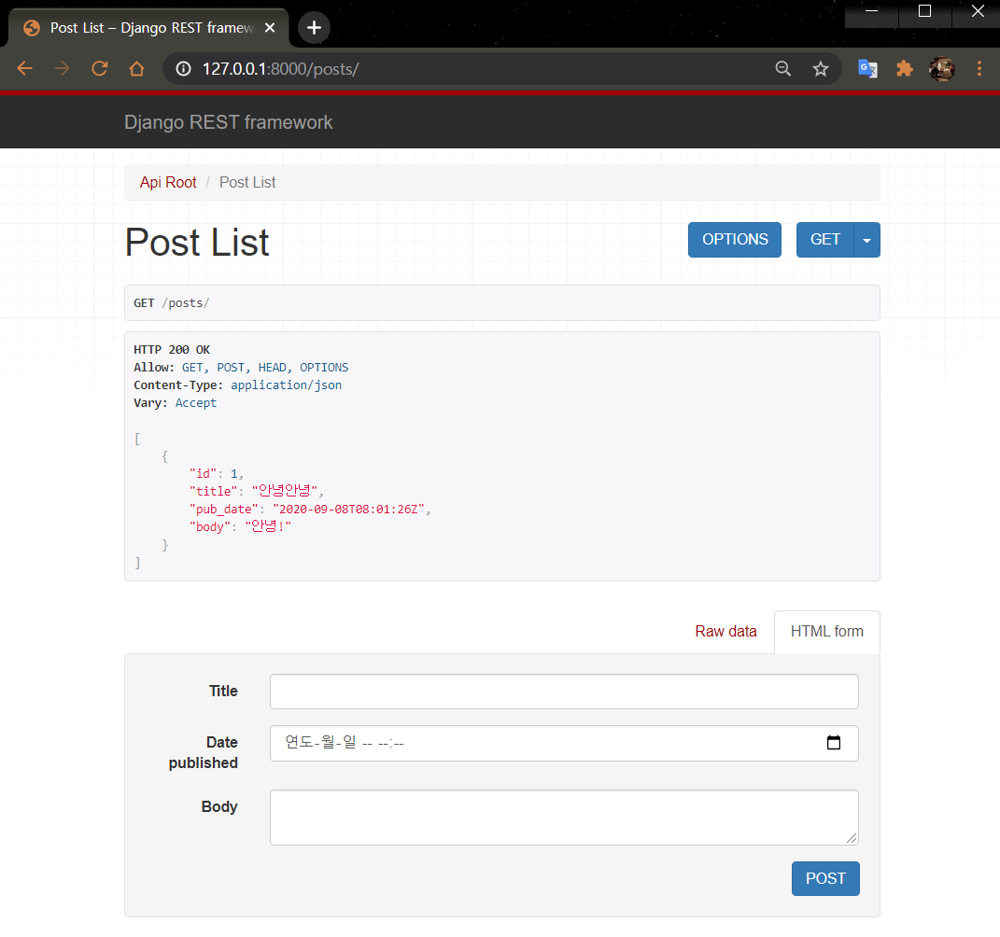
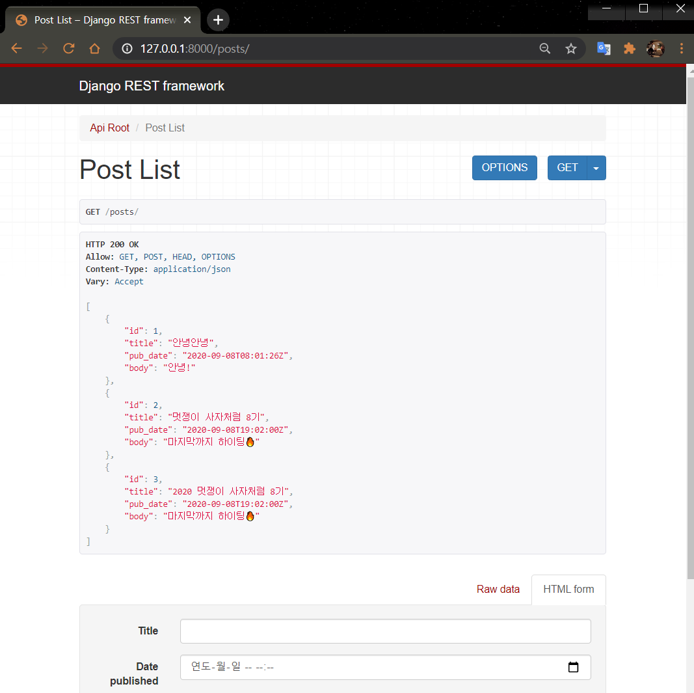

# Django Rest Framework?
  
  
  
#### 🧱Preference

> Windows10  
> python 3.7 이상  
> Git Bash  
> Django 기본적인 개념  
> HTTP Method  

---

앞서 설명한 REST의 장점과 필요성을 어느정도 이해하였으면, 실제로 사용해보아야겠죠.

## 1. DRF(Django Rest Framework)란?

Django 안에서 RESTful API 서버를 쉽게 구축할 수 있도록 도와주는 오픈소스 라이브러리입니다.

[공식문서](https://www.django-rest-framework.org/)에서 설명하는 Django REST Framework를 사용하는 이유는 아래와 같다.

- 웹 브라우저 API는 개발자에게 큰 사용성을 즉 개발을 쉽게 만들어 준다.  
- 인증 정책에 OAuth1, OAuth2를 위한 추가적인 패키지가 추가 되어 있는 경우  
- 시리얼라이즈 기능을 제공을 해준다. (DB data -> JSON)  
- 문서화 및 커뮤니티 지원이 잘 되어있다.  

---

## 2. Django 기본 app 만들기

DRF를 사용하기 앞서 기본 구조를 만들기 위해 [이전 세션](https://jun108059.github.io/django-blog/Blogdjango/01.djangoblog.html)의 내용을 참고해서 다음과 같은 구조를 만들어봅시다.

```shell script
rest_tutorial
├── api
│   ├── __init__.py
│   ├── admin.py
│   ├── apps.py
│   ├── migrations
│   │   └── __init__.py
│   ├── models.py
│   ├── tests.py
│   ├── urls.py
│   └── views.py
├── db.sqlite3
├── manage.py
└── tutorial
    ├── __init__.py
    ├── settings.py
    ├── urls.py
    └── wsgi.py
```

```shell script
$ python -m venv myvenv # 가상환경 생성

$ source myvenv/scripts/activate # 가상환경 실행

$ pip install django # django 설치

$ django-admin startproject tutorial #프로젝트 생성

$ python manage.py startapp api # app 생성
```

---

### ⏹ 2.1 app 기본 mapping

[이전 세션](https://jun108059.github.io/django-blog/Blogdjango/01.djangoblog.html)에서 했던 내용과 거의 동일하기 때문에 참고하시려면 아래 버튼을 눌러서 보시면 됩니다.

<details>
<summary>✍ 기본 설정 살펴보기</summary>

#### 2.1.1. settings.py 설정

`rest_tutorial/tutorial/settings.py`

```python
INSTALL_APPS = [
	...
    'api', # add
]
```

#### 2.1.2 views.py 설정

`rest_tutorial/api/views.py`

```python
from django.shortcuts import render
from django.http import HttpResponse

def hello(request):
    return HttpResponse("<h1>Hello, world!</h1>")
```

#### 2.1.3 urls.py 설정

`rest_tutorial/tutorial/urls.py`

```python
from django.contrib import admin
from django.urls import path
import api.views   # views.py 에 작성한 hello 함수 불러오기

urlpatterns = [
    path('admin/', admin.site.urls),
    path('', api.views.hello, name="hello"),
]
```

#### 2.1.4 Model 생성

`rest_tutorial/api/models.py`

```python
from django.db import models

class Post(models.Model):
    title = models.CharField(max_length=200)
    pub_date = models.DateTimeField('date published')
    body = models.TextField()

    def __str__(self):
        return self.title

```

**Migration**

```shell script
$ python manage.py makemigrations
$ python manage.py migrate
```

#### 2.1.5 Admin 생성

```shell script
$ python manage.py createsuperuser
```

#### 2.1.6 Admin에 model 등록

`rest_tutorial/api/admin.py`

```python
from django.contrib import admin
from .models import Post

admin.site.register(Post)
```

기본적인 Setting은 이정도만 해도 좋습니다.

</details>

---

## 3. Django Rest Framework 설치

Python 가상환경을 실행시켜주고 `pip`로 간단하게 설치해줄 수 있습니다.

```shell script
pip install djangorestframework
```

### ⏹ 3.1 setting.py 설정에 추가하기

`rest_tutorial/tutorial/settings.py`

```python
INSTALL_APPS = [
	...
    'api',
    'rest_framework', # add
]
```

---

## 4. DRF의 핵심 기능 - Serializer 란

지난 포스팅에서 알아본 Web이 아닌 Android App과 같은 멀티 플랫폼을 전부 하나의 `back-end`에서 처리할 수 있는 REST의 장점을 그대로 사용하려면 `JSON` 등의 데이터 형식을 사용하는게 좋다고 했었죠!

**Serializer**가 `queryset`과 `모델 인스턴스`와 같은 복잡한 데이터를 `JSON`, `XML` 또는 다른 콘텐츠 유형으로 쉽게 변환할 수 있는 기능을 제공합니다.

받은 데이터의 유효성을 검사한 다음, 복잡한 타입으로 형 변환할 수 있도록 `serializeation`을 제공하기 때문에 가능합니다.

> 물론 SErializer를 통해 모델 인스턴스가 JSON 또는 Dictionary 형태로 `직렬화`되면 좋은 점은 더 많습니다!

---

### ⏹ 4.1 serializers.py 생성

api 폴더 아래에 다음 python 파일을 추가해주세요.

`rest_tutorial/api/serializers.py`

```python
from rest_framework import serializers
from .models import Post

class PostSerializer(serializers.ModelSerializer):
    class Meta:
        model = Post  # 모델 설정
        fields = ('id', 'title', 'pub_date', 'body')  # 필드 설정
```

### ⏹ 4.2 views.py 작성

DRF는 보통 사람들이 자주 사용하는 공통적인 view 로직을 그룹화 한 `viewset`을 제공합니다.

`viewset`을 사용하게 되면 CRUD 로직을 직접 짜지 않아도 이 기능들이 사용 가능해집니다.

~~아무코토~~ 하지 않아도 CRUD 기능이 다 된다는 거죠!

`rest_tutorial/api/views.py`

```python
from rest_framework import viewsets
from .serializers import ApiSerializer
from .models import Post

class ApiViewSet(viewsets.ModelViewSet):
    queryset = Post.objects.all()
    serializer_class = ApiSerializer
```

### ⏹ 4.3 urls.py 작성

DRF는 url을 자동으로 맵핑해주는 router를 제공합니다. 앞서 생성한 viewset을 router에 연결하게 되면 자동으로 url을 맵핑해주어 사용자가 직접 url을 맵핑하지 않아도 됩니다.

```python
from django.contrib import admin
from django.urls import path, include
from rest_framework import routers
from api import views

router = routers.DefaultRouter()
router.register(r'posts', views.PostViewSet)
# prefix = posts, viewSet = PostViewSet

urlpatterns = [
    path('admin/', admin.site.urls),
    path('', include(router.urls)),
]
```

위에서 router.register로  prefix를 'posts'로 설정을 해주었습니다.

router는 이를 바탕으로 url을 맵핑하게 됩니다.

```python
URL pattern: ^posts/$ Name: 'post-list'
```

---

## 5. 실행하기

```shell script
$ python manage.py runserver
```

### ⏹ 5.1 완성!

만든 `api`로 `CRUD` 요청을 해봅시다.

api 요청 uri과 method를 정리해보면 다음과 같습니다.

`GET /posts/` : 게시글 리스트 조회

`POST /posts/` : 게시글 추가

`PUT /posts/` : 게시글 수정

`DELETE /posts/` : 게시글 삭제

---

먼저 `localhost:8000` 으로 들어가게 되면 해당 화면이 보일 거에요.

  

posts 링크로 들어가봅시다.

  

`GET /posts/`는 게시글 리스트를 요청하는 uri이다.

아래 `form`으로 게시글 정보를 입력해보세요.

입력 하고 `post` 버튼을 누르면 POST 메소드로 `/posts/` uri에 요청이 가고, 해당 정보가 저장됩니다.



---

나머지 기능도 한번 테스트 해보세요!

DRF는 더욱 많은 기능을 제공하고 커스텀할 수 있게 제공되니까
프로젝트를 진행할 때 활용하면 더욱 편리하게 만들 수 있겠죠!

---

#### Reference

- https://jamanbbo.tistory.com/43  
- https://www.django-rest-framework.org/tutorial/quickstart/  

---